# Sơ đồ Activity — Hệ thống HRM

> Luồng quy trình nghiệp vụ được mô tả bằng sơ đồ activity UML.

---

## 1. Quy trình Duyệt Nghỉ phép

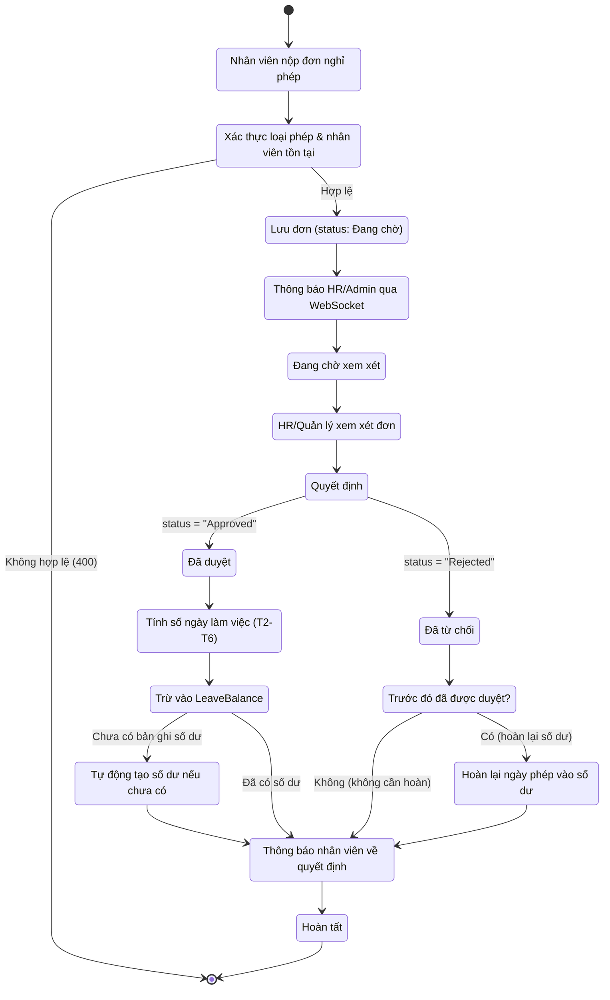

---

## 2. Quy trình Tạo Bảng lương

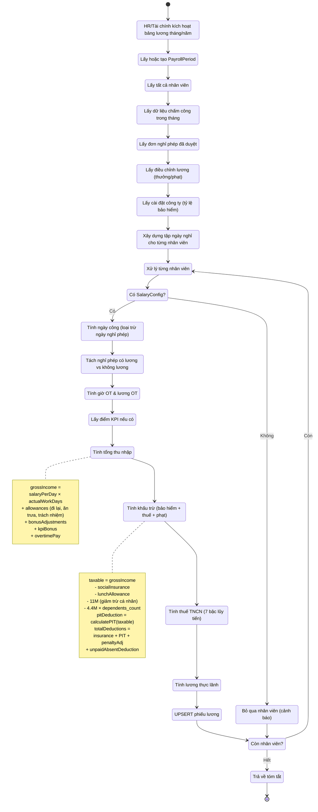

---

## 3. Quy trình Chấm công QR (Check-in/Check-out)

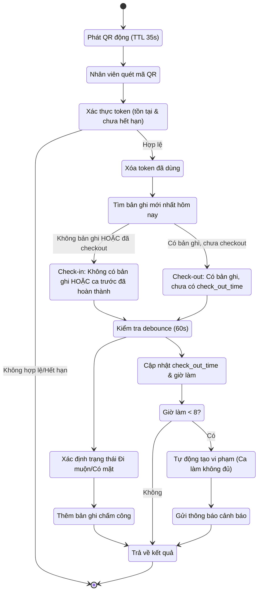

---

## 4. Quy trình Check-in bằng IP (Whitelist)

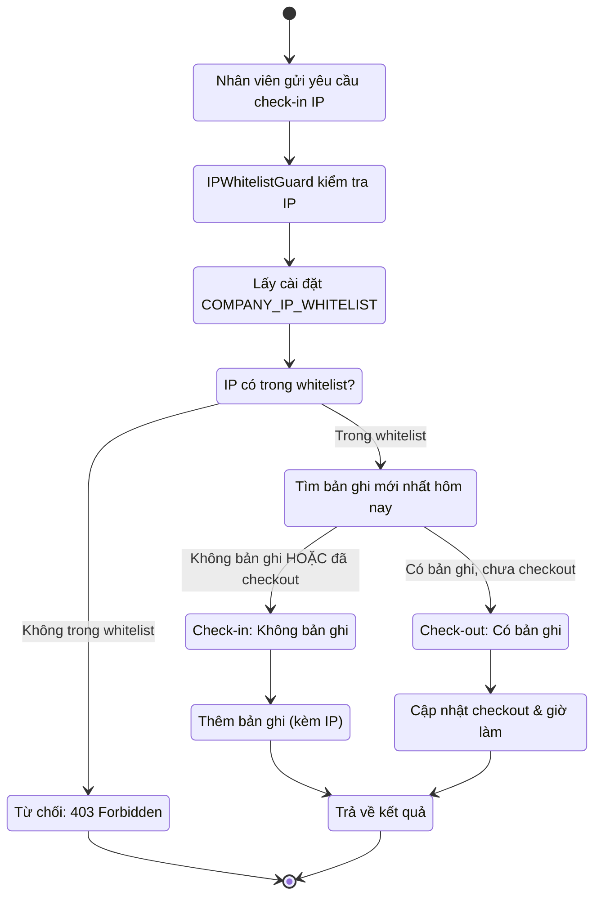

---

## 5. Quy trình Từ chức

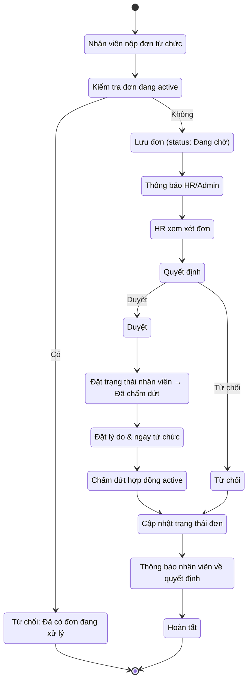

---

## 6. Quy trình Phân phối Thông báo (WebSocket Real-time)

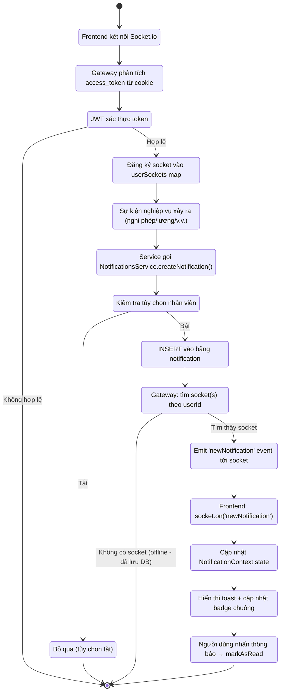

---

## 7. Quy trình Cron Đồng bộ Chấm công Hàng ngày (Nửa đêm)

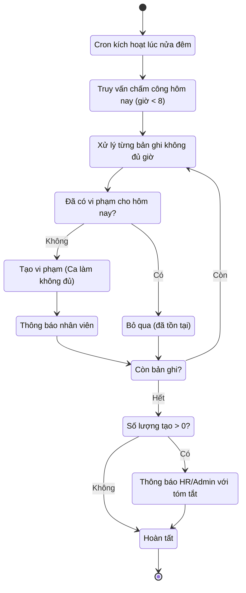

---

## 8. Quy trình Quản lý KPI (Thư viện → Kỳ → Gán → Chấm điểm)

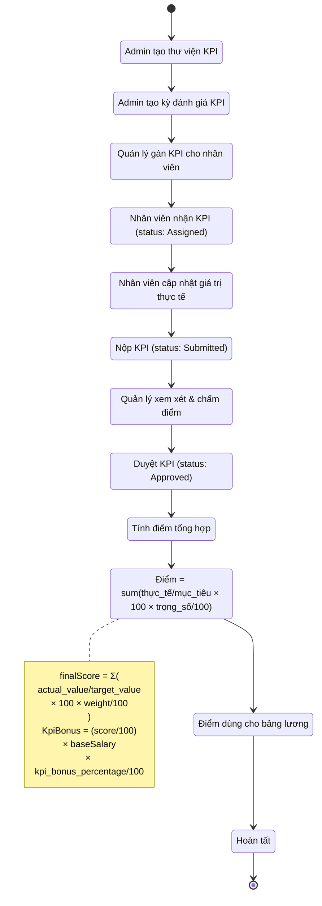

---

## 9. Quy trình Vòng đời Hợp đồng Lao động

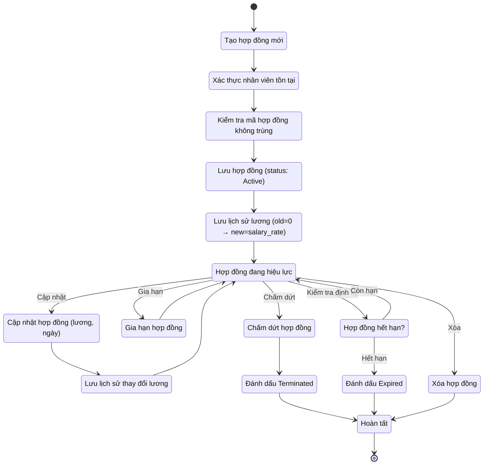

---

## 10. Quy trình Vòng đời Nhân viên (Onboard → Active → Offboard)

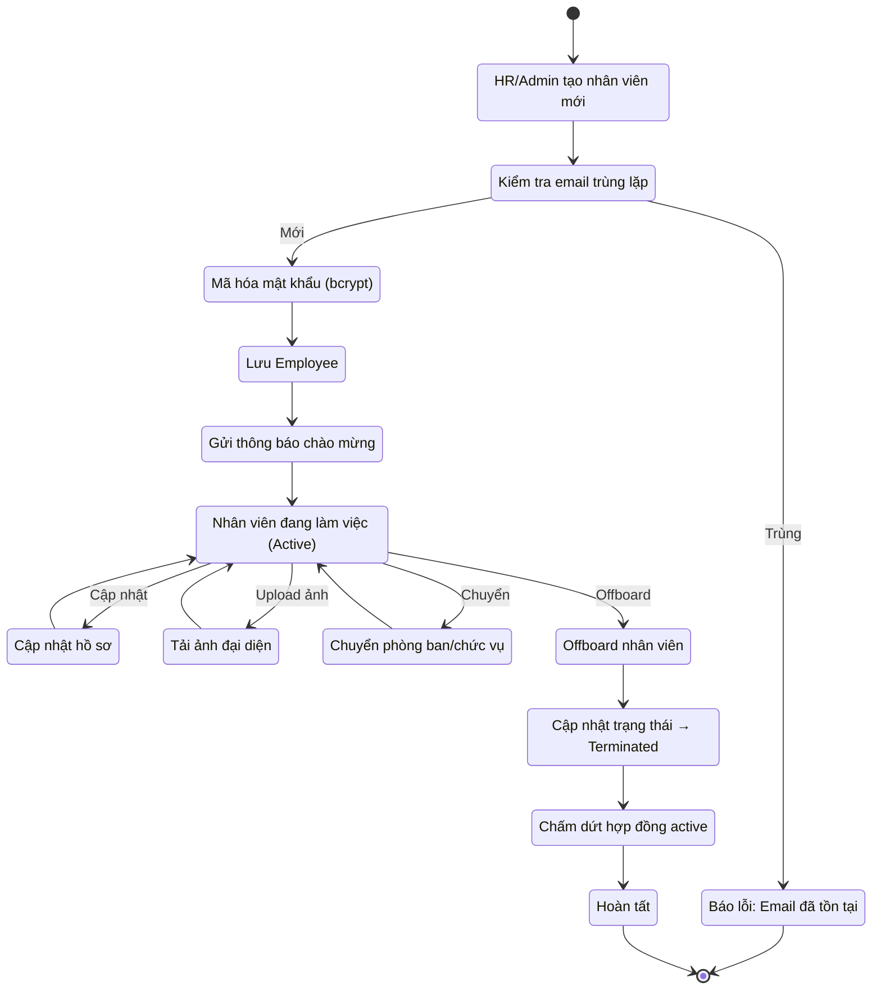

---

## 11. Quy trình Quản lý & Đồng bộ Vi phạm

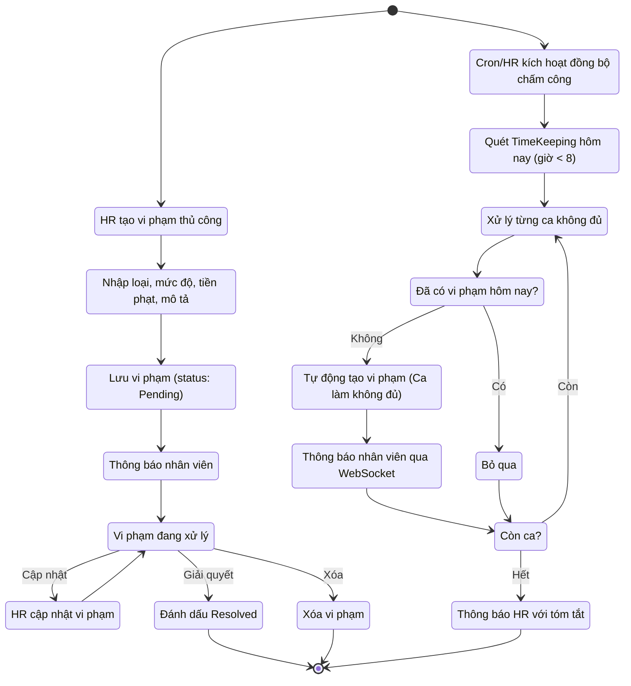

---

## 12. Quy trình Đăng & Phân phối Thông báo Công ty

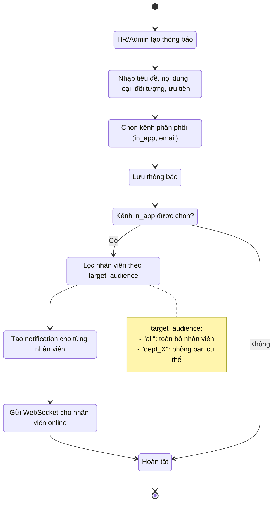

---

## 13. Quy trình Nhắn tin Trực tiếp (1:1 Chat)

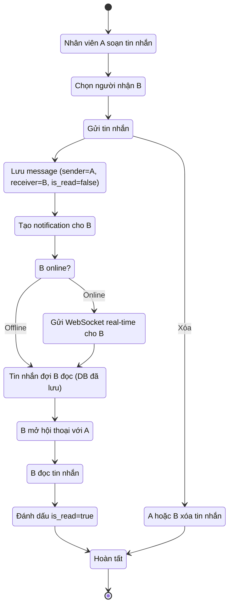

---

## 14. Quy trình Tạo Báo cáo & Phân tích

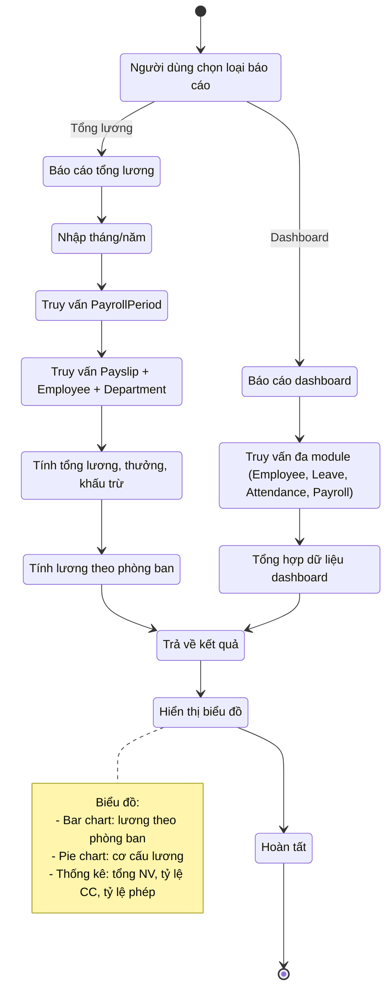

---

## 15. Quy trình Quản lý Phân quyền RBAC

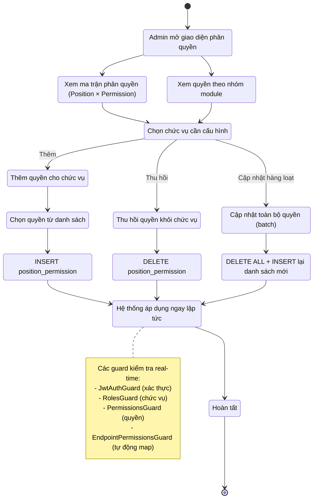

---

## 16. Quy trình Quản lý Ngày lễ/Nghỉ lễ

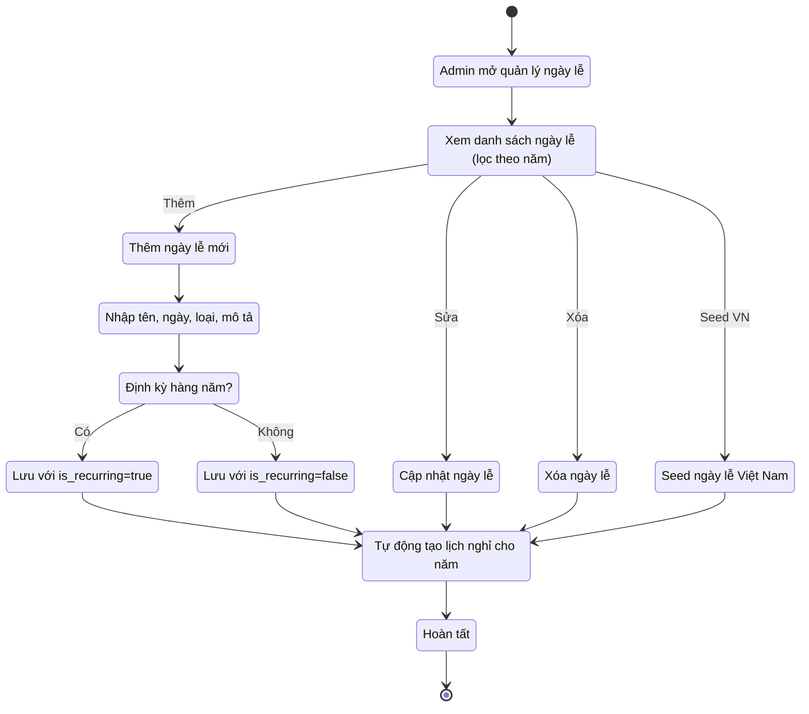

---

## Tổng kết các module được bao hàm

| # | Module | Activity Diagram | Mô tả |
|---|--------|-----------------|-------|
| 1 | Leave | Duyệt nghỉ phép | Nộp → xác thực → duyệt/từ chối → trừ/hoàn số dư |
| 2 | Payroll | Tạo bảng lương | Pipeline tính lương với OT, KPI, thuế, bảo hiểm |
| 3 | Timekeeping | Chấm công QR | QR động → quét → check-in/out → phát hiện vi phạm |
| 4 | Timekeeping | Check-in IP | IP whitelist guard → xác thực → check-in/out |
| 5 | Resignation | Từ chức | Nộp đơn → kiểm tra trùng → duyệt → chấm dứt |
| 6 | Notification | Phân phối thông báo WebSocket | Kết nối → sự kiện → kiểm tra tùy chọn → gửi → hiển thị |
| 7 | Timekeeping | Cron đồng bộ chấm công | Quét nửa đêm → phát hiện ca thiếu → tạo vi phạm → thông báo |
| 8 | KPI | Quản lý KPI | Thư viện → kỳ → gán → cập nhật → nộp → chấm → tính điểm |
| 9 | Contract | Vòng đời hợp đồng | Tạo → active → cập nhật/gia hạn → hết hạn/chấm dứt |
| 10 | Employee | Vòng đời nhân viên | Tạo → bank + phép → active → cập nhật → offboard |
| 11 | Violation | Quản lý & đồng bộ vi phạm | Tạo thủ công + tự động sync từ chấm công |
| 12 | Announcement | Đăng & phân phối thông báo | Tạo → lọc đối tượng → gửi in_app/email |
| 13 | Message | Nhắn tin 1:1 | Soạn → gửi → thông báo → đọc → xóa |
| 14 | Reports | Tạo báo cáo & phân tích | Chọn loại → truy vấn → tổng hợp → hiển thị biểu đồ |
| 15 | RBAC | Quản lý phân quyền | Xem ma trận → gán/thu hồi → cập nhật batch → áp dụng |
| 16 | Holiday | Quản lý ngày lễ | CRUD + seed ngày lễ Việt Nam + lịch định kỳ |
