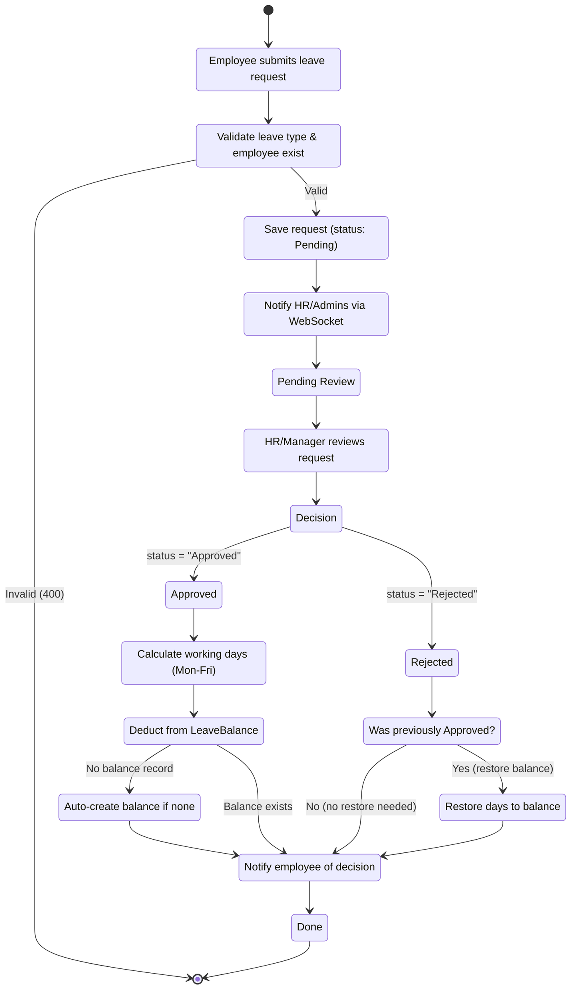
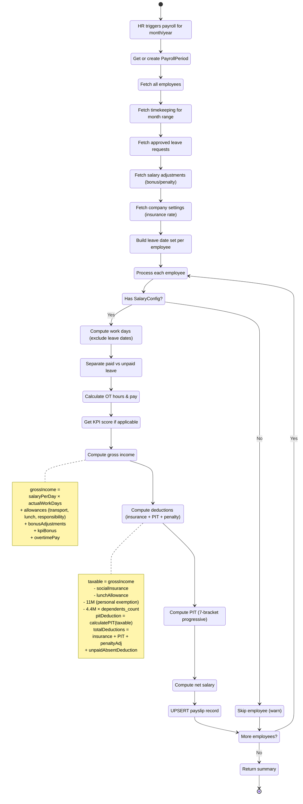
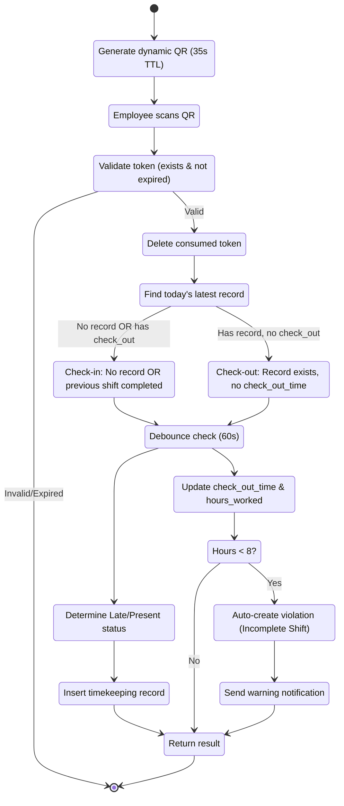
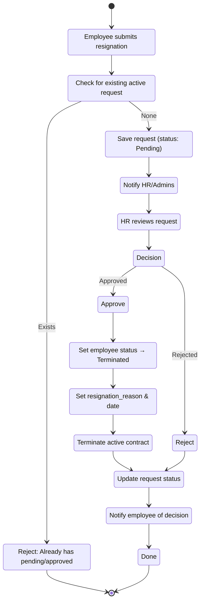
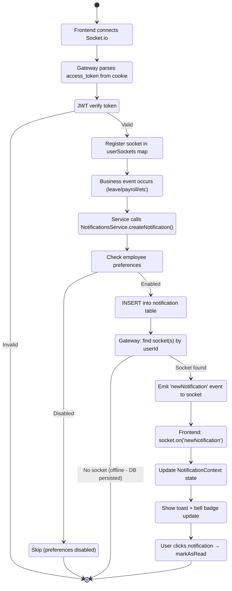
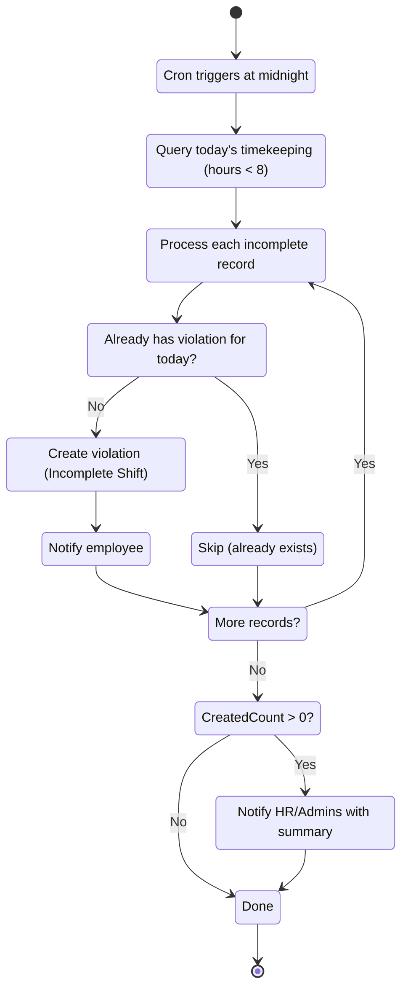

# Activity Diagrams — HRM System

> Business process workflows visualized as UML activity diagrams.

---

## 1. Leave Approval Workflow

---

## 2. Payroll Generation Workflow

---

## 3. Timekeeping Workflow (QR Check-in/Check-out)

---

## 4. Resignation Workflow

---

## 5. Notification Delivery Workflow (WebSocket Real-time)

---

## 6. Daily Attendance Sync Cron (Midnight)

