# Sơ đồ Sequence — Hệ thống HRM

> Các luồng vận hành chính được mô tả bằng sơ đồ sequence.

---

## 1. Luồng Đăng nhập & Xác thực

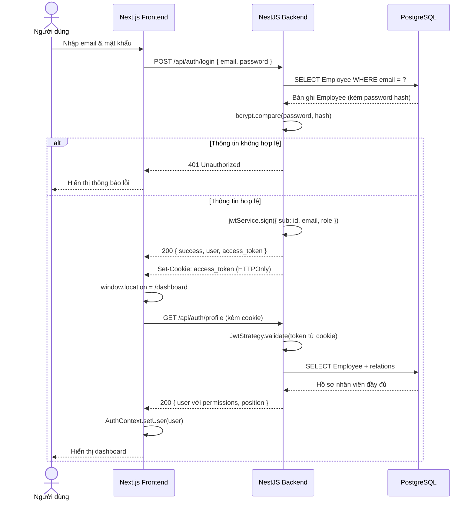

---

## 2. Luồng Nộp đơn Nghỉ phép → Duyệt → Cập nhật số dư

---

## 3. Luồng Check-in / Check-out (Quét mã QR)

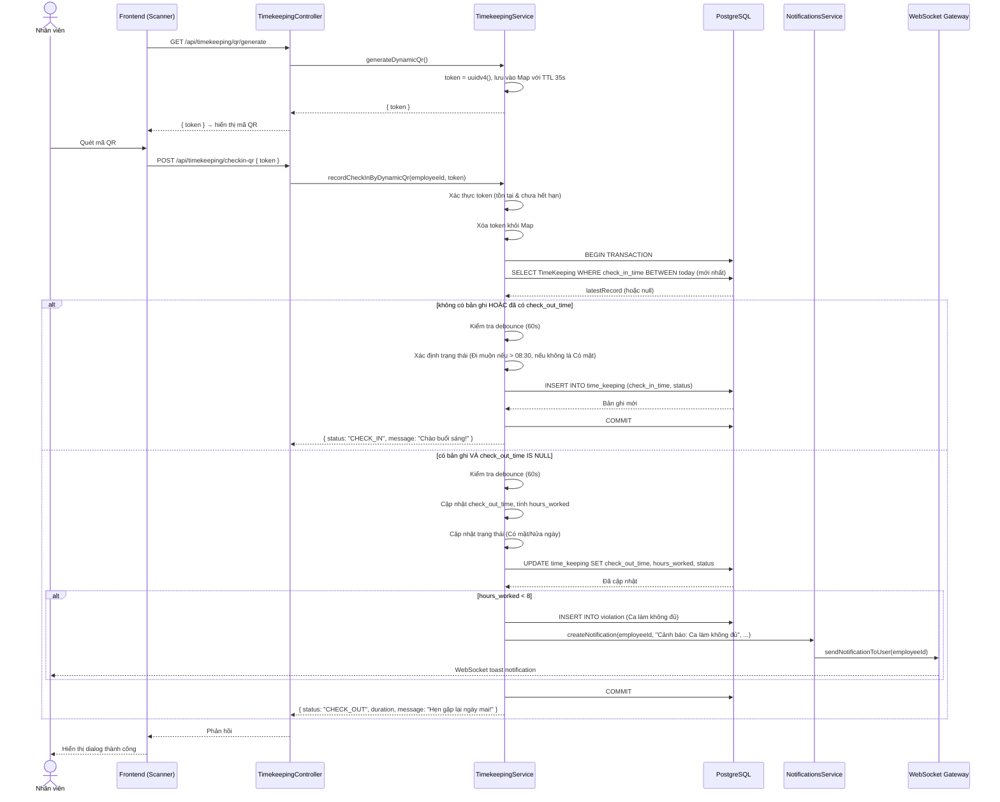

---

## 4. Luồng Check-in bằng IP (Whitelist IP văn phòng)

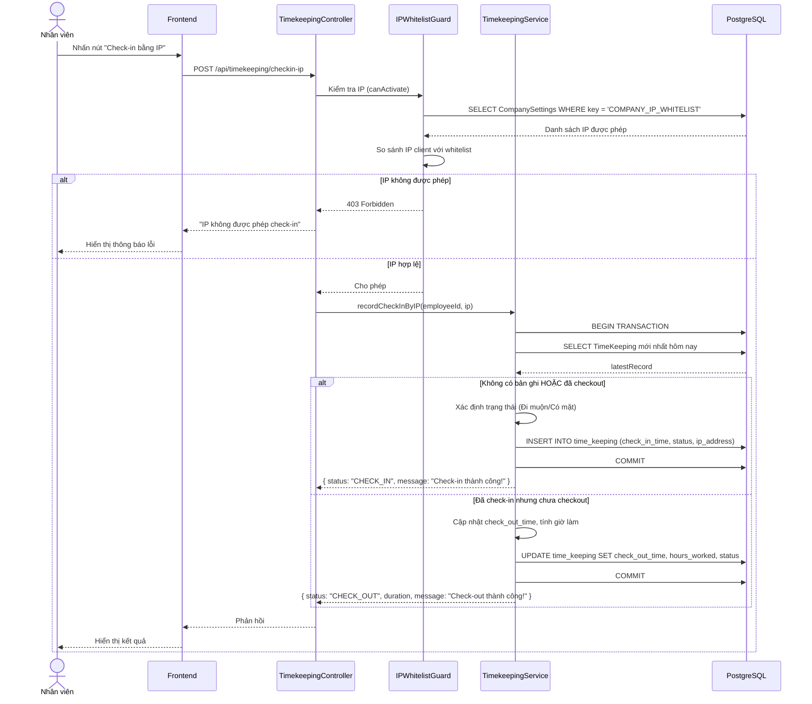

---

## 5. Luồng Tạo Bảng lương (Pipeline đầy đủ)

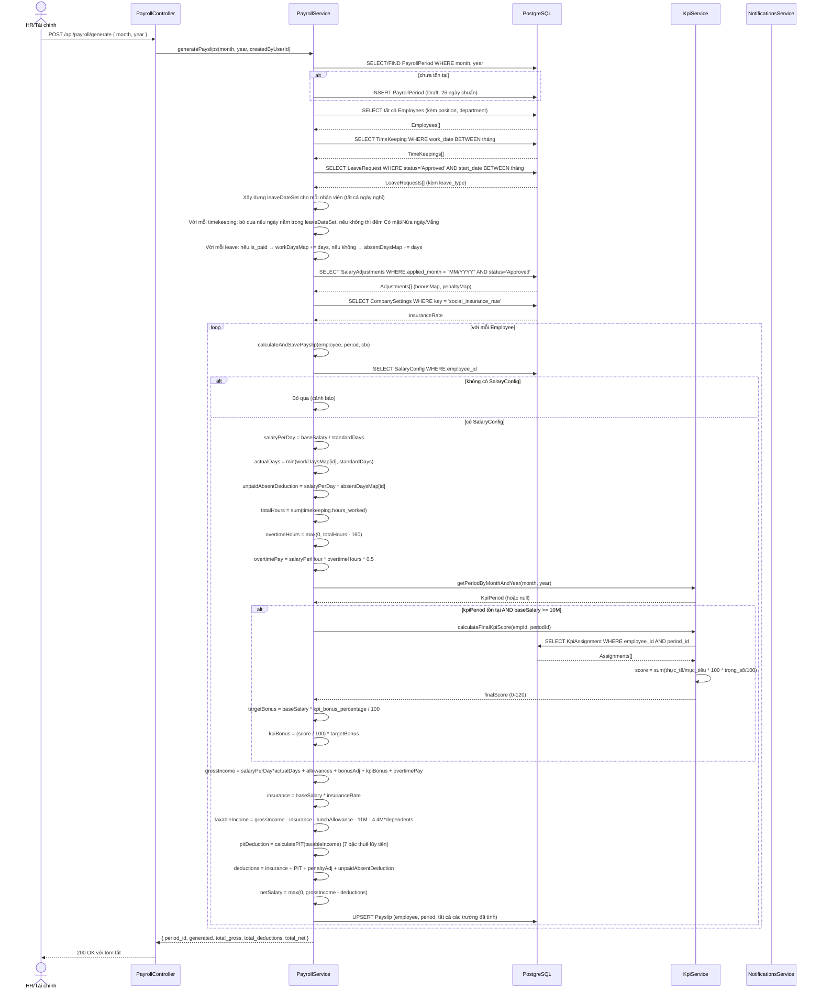

---

## 6. Luồng Phân phối Thông báo (WebSocket Real-time)

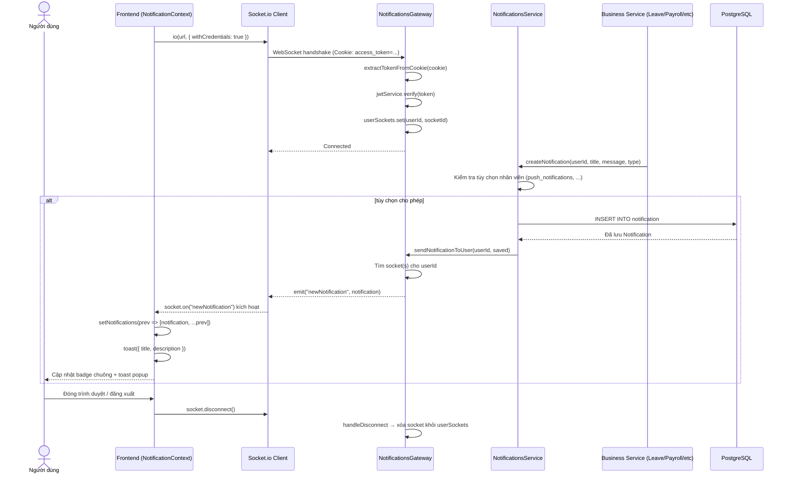

---

## 7. Luồng Từ chức

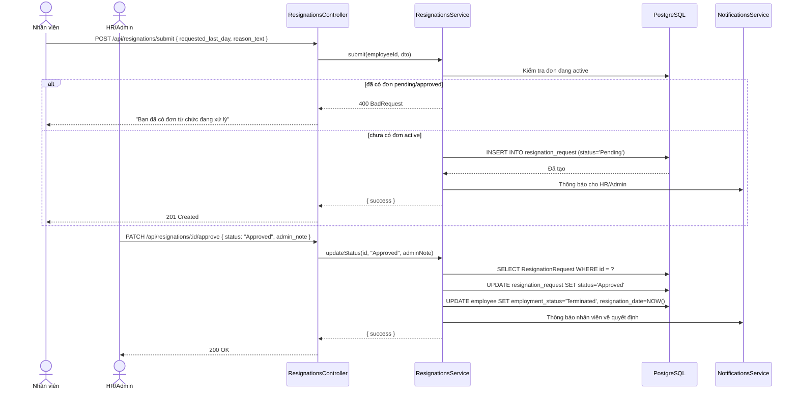

---

## 8. Luồng Quản lý Hợp đồng Lao động

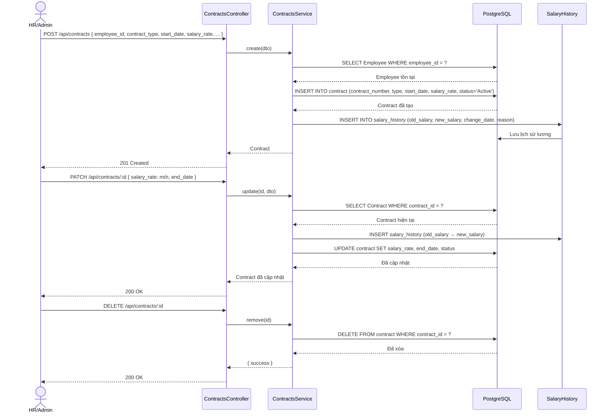

---

## 9. Luồng Onboarding & Offboarding Nhân viên

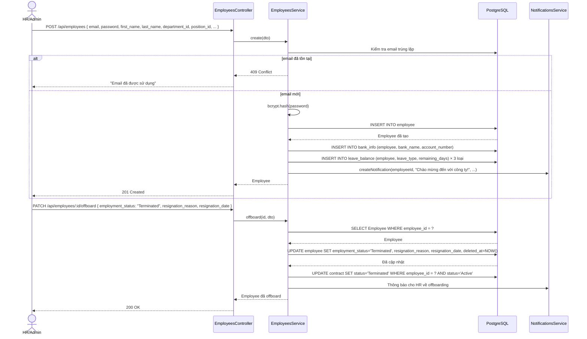

---

## 10. Luồng Gán KPI & Chấm điểm

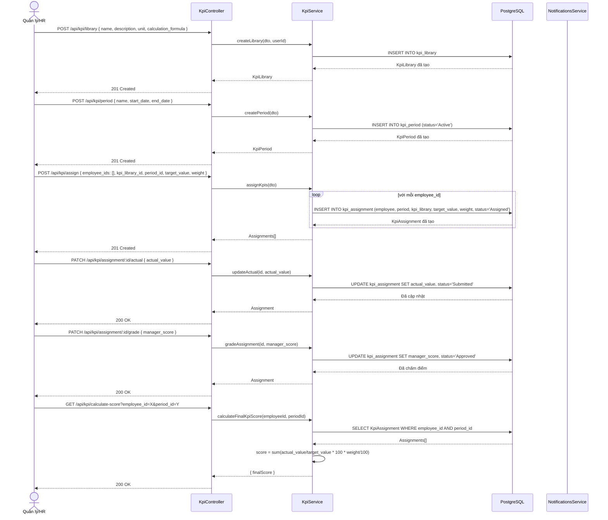

---

## 11. Luồng Phát hiện & Đồng bộ Vi phạm Chấm công

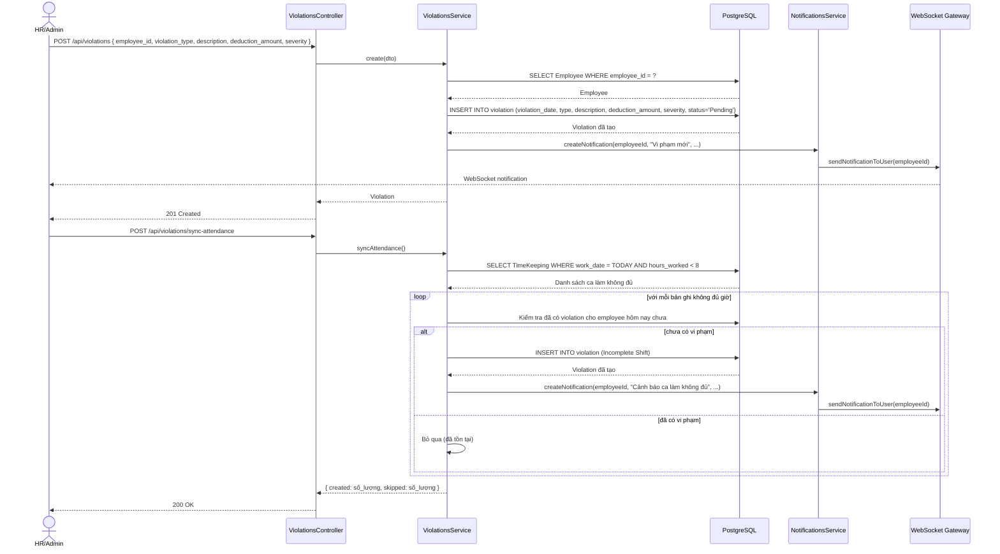

---

## 12. Luồng Tạo & Phát Thông báo Công ty (Announcement)

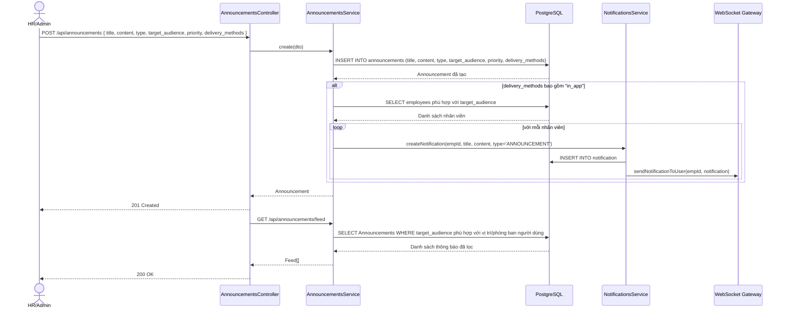

---

## 13. Luồng Nhắn tin Trực tiếp (1:1 Chat)

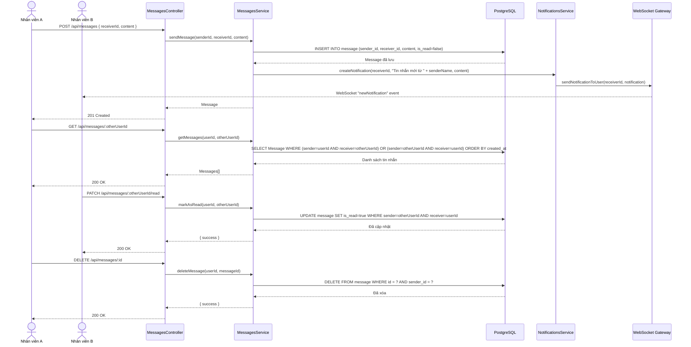

---

## 14. Luồng Tổng hợp Dữ liệu Dashboard

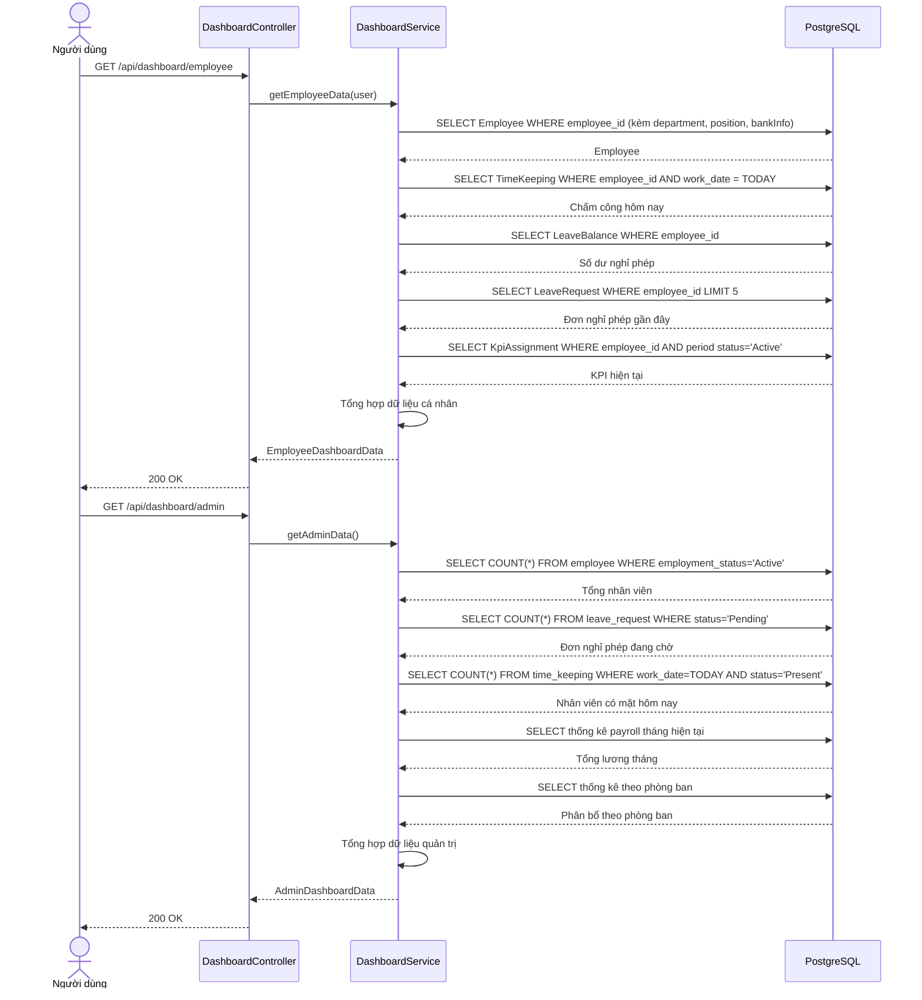

---

## 15. Luồng Quản lý Phân quyền RBAC

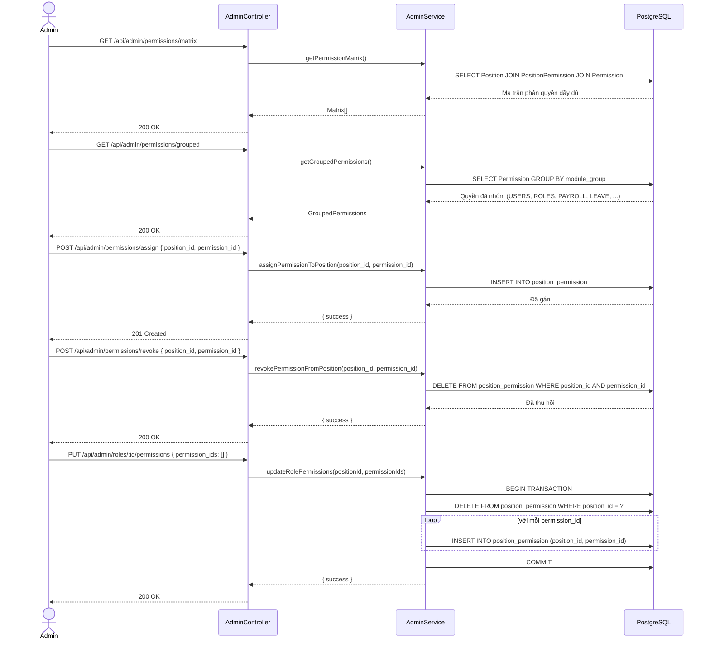

---

## 16. Luồng Tạo Báo cáo & Phân tích

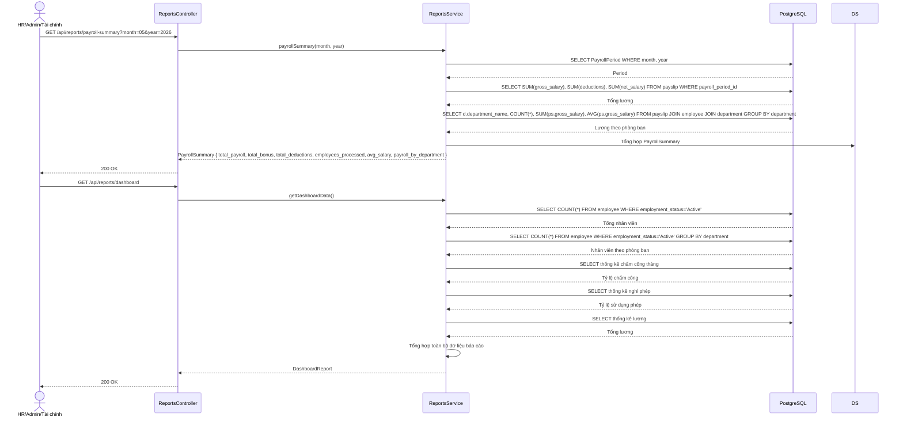

---

## Tổng kết các module được bao hàm

| # | Module | Sequence Diagram | Mô tả |
|---|--------|-----------------|-------|
| 1 | Auth | Đăng nhập & Xác thực | JWT login, cookie, profile, navigation |
| 2 | Leave | Nộp đơn → Duyệt → Cập nhật số dư | Quy trình đầy đủ gồm cả hoàn số dư |
| 3 | Timekeeping | Check-in/out QR | QR động 35s TTL, debounce, tự động phát hiện vi phạm |
| 4 | Timekeeping | Check-in/out IP | IP whitelist guard, văn phòng/từ xa |
| 5 | Payroll | Tạo bảng lương đầy đủ | Pipeline tính lương gồm OT, KPI, thuế, bảo hiểm |
| 6 | Notification | Phân phối thông báo WebSocket | Kết nối, gửi, nhận, toast, badge |
| 7 | Resignation | Từ chức | Nộp đơn → duyệt/từ chối → chấm dứt |
| 8 | Contract | Quản lý hợp đồng | Tạo → cập nhật → xóa + lịch sử lương |
| 9 | Employee | Onboarding & Offboarding | Tạo nhân viên + bank + phép; offboard + chấm dứt hợp đồng |
| 10 | KPI | Gán KPI & Chấm điểm | Thư viện → kỳ → gán → cập nhật → chấm → tính điểm |
| 11 | Violation | Phát hiện & Đồng bộ vi phạm | Tạo thủ công + tự động sync từ chấm công |
| 12 | Announcement | Tạo & Phát thông báo công ty | Tạo → lọc đối tượng → gửi notification hàng loạt |
| 13 | Message | Nhắn tin 1:1 | Gửi → nhận → đánh dấu đã đọc → xóa |
| 14 | Dashboard | Tổng hợp dữ liệu dashboard | Nhân viên + quản trị + ngày lễ |
| 15 | RBAC | Quản lý phân quyền | Xem ma trận → gán → thu hồi → cập nhật hàng loạt |
| 16 | Reports | Báo cáo & Phân tích | Tổng lương, dashboard, thống kê đa chiều |
