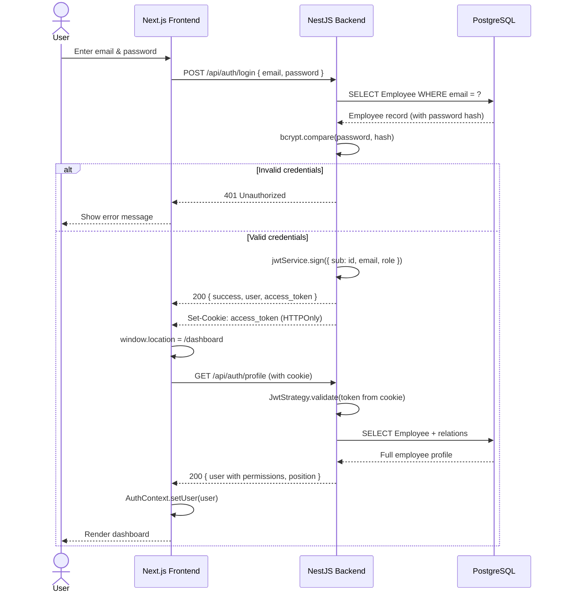
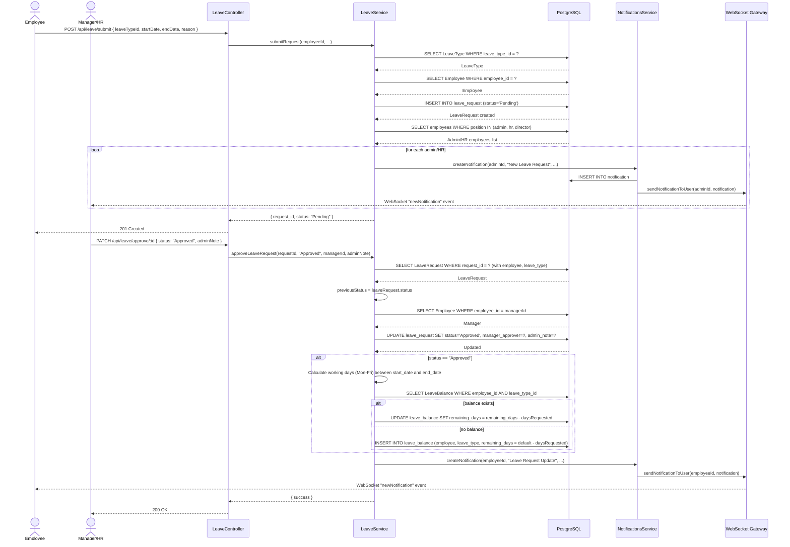
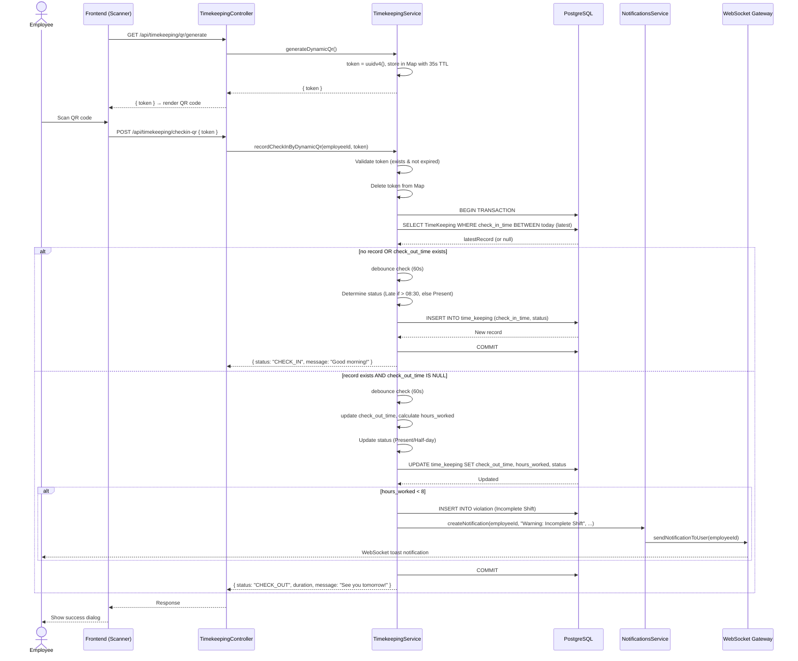
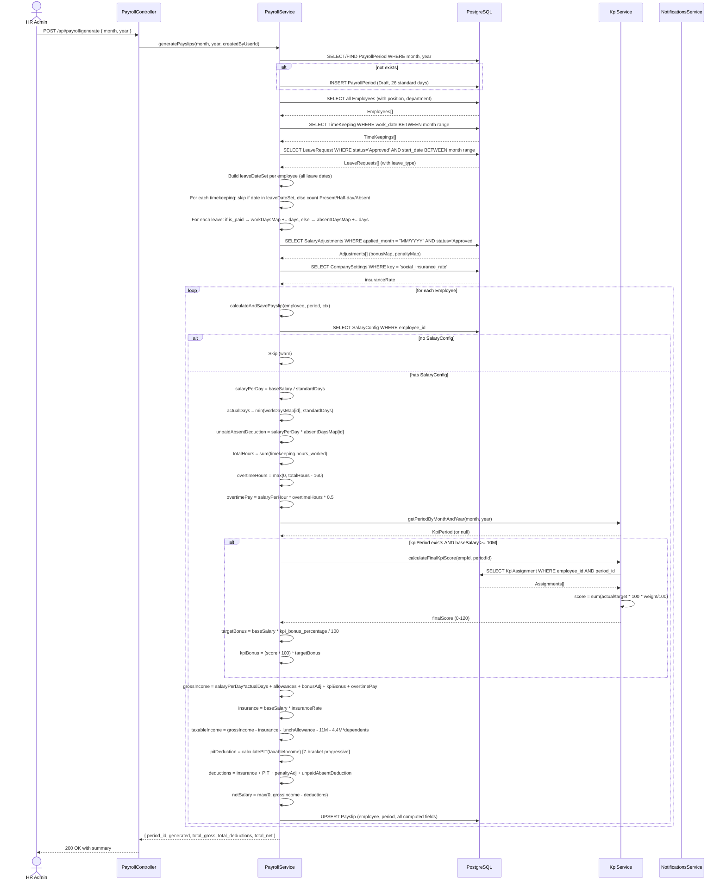
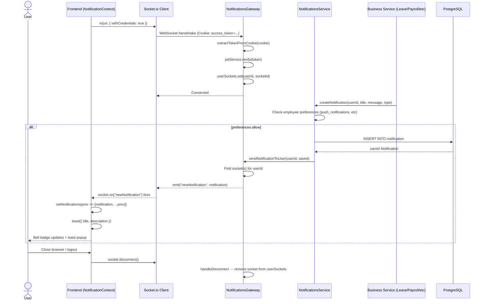
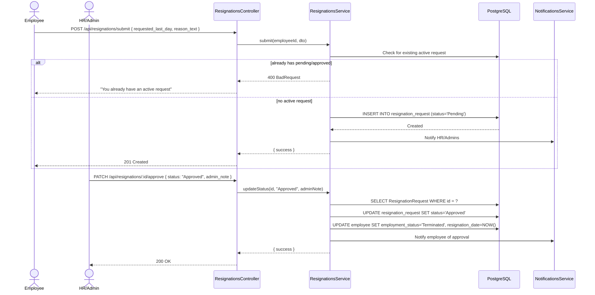

# Sequence Diagrams — HRM System

> Key operational flows visualized as sequence diagrams.

---

## 1. Login & Authentication Flow

---

## 2. Leave Request → Approval → Balance Update

---

## 3. Check-in / Check-out Flow (QR-based)

---

## 4. Payroll Generation Flow (Complete Pipeline)

---

## 5. Notification Delivery (WebSocket Real-time)

---

## 6. Resignation Flow

