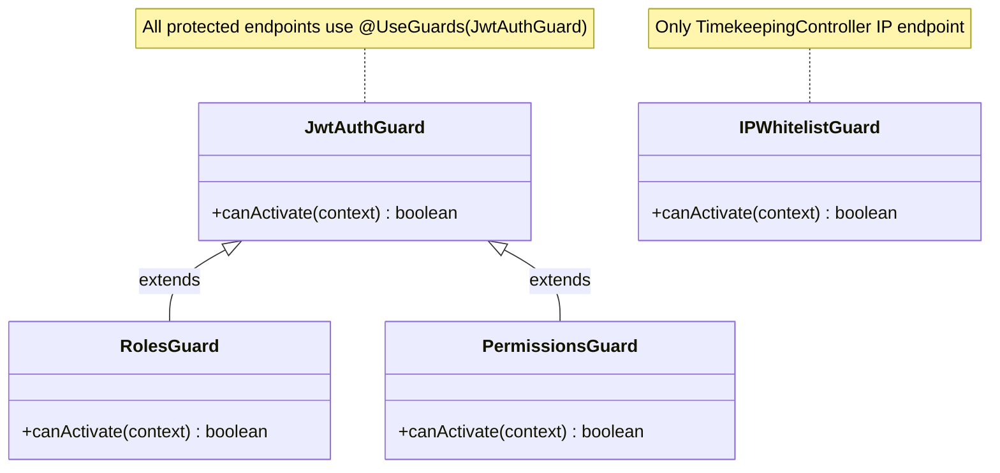

# UML Class Diagram — HRM System

> Service layer architecture, module dependencies, and class hierarchy.

---

## Module Dependency Graph

```mermaid
graph TD
    subgraph "Core Modules"
        Auth[Auth Module]
        Employees[Employees Module]
        Departments[Departments Module]
        Positions[Positions Module]
        Permissions[Permissions Module]
        CompanyProfile[Company Profile Module]
        CompanySettings[Company Settings]
    end

    subgraph "HR Operations"
        Contracts[Contracts Module]
        Leave[Leave Module]
        Timekeeping[Timekeeping Module]
        Violations[Violations Module]
        Resignations[Resignations Module]
    end

    subgraph "Finance"
        Payroll[Payroll Module]
        KPI[KPI Module]
    end

    subgraph "Communication"
        Announcements[Announcements Module]
        Messages[Messages Module]
        Comments[Comments Module]
        Notifications[Notifications Module]
    end

    subgraph "Analytics"
        Dashboard[Dashboard Module]
        Reports[Reports Module]
        Analytics[Analytics Module]
    end

    subgraph "Admin"
        Admin[Admin Module]
    end

    %% Core dependencies
    Auth --> Employees
    Auth --> Notifications

    %% HR Operations depend on Core
    Leave --> Notifications
    Leave --> Employees
    Timekeeping --> Notifications
    Timekeeping --> Violations
    Violations --> Notifications
    Resignations --> Notifications
    Contracts --> Employees

    %% Finance dependencies
    Payroll --> Notifications
    Payroll --> KPI
    Payroll --> Employees
    KPI --> Employees

    %% Communication dependencies
    Announcements --> Notifications
    Messages --> Notifications
    Comments --> Notifications

    %% Notifications is the hub
    Notifications -.-> Leave
    Notifications -.-> Payroll
    Notifications -.-> Timekeeping
    Notifications -.-> Violations
    Notifications -.-> Resignations
    Notifications -.-> Announcements
    Notifications -.-> Messages
    Notifications -.-> Comments
    Notifications -.-> Employees
```

---

## Service Layer Class Diagram

```mermaid
classDiagram
    direction TB

    class AuthService {
        -employeeRepo: Repository~Employee~
        -jwtService: JwtService
        +validateUser(email, password) User
        +login(user) tokenData
        +register(dto) Employee
    }

    class EmployeesService {
        -employeeRepo: Repository~Employee~
        -dataSource: DataSource
        +create(dto) Employee
        +findAll(filters) Employee[]
        +findOne(id) Employee
        +update(id, dto) Employee
        +softDelete(id) void
        +offboard(id, reason) void
    }

    class LeaveService {
        -leaveReqRepo: Repository~LeaveRequest~
        -balanceRepo: Repository~LeaveBalance~
        -leaveTypeRepo: Repository~LeaveType~
        -employeeRepo: Repository~Employee~
        -notificationsService: NotificationsService
        +getLeaveTypes() LeaveType[]
        +getBalance(employeeId) LeaveBalance[]
        +getMyRequests(employeeId) LeaveRequest[]
        +submitRequest(employeeId, leaveTypeId, startDate, endDate, reason) LeaveRequest
        +getPendingRequests() { data, stats }
        +approveLeaveRequest(requestId, status, managerId, adminNote) void
    }

    class TimeKeepingService {
        -tkRepo: Repository~TimeKeeping~
        -empRepo: Repository~Employee~
        -violationRepo: Repository~Violation~
        -notificationsService: NotificationsService
        -dataSource: DataSource
        -dynamicQrTokens: Map~string, number~
        +generateDynamicQr() token
        +recordCheckInByDynamicQr(employeeId, token) result
        +recordCheckInByIP(employeeId, ip) result
        +getAllForAdmin(page, limit, startDate, endDate) paginated
    }

    class PayrollService {
        -STANDARD_MONTHLY_HOURS: 160
        -OVERTIME_RATE: 1.5
        -employeeRepo: Repository~Employee~
        -payslipRepo: Repository~Payslip~
        -payrollPeriodRepo: Repository~PayrollPeriod~
        -salaryConfigRepo: Repository~SalaryConfig~
        -leaveRequestRepo: Repository~LeaveRequest~
        -adjustmentRepo: Repository~SalaryAdjustment~
        -settingsRepo: Repository~CompanySettings~
        -kpiService: KpiService
        -notificationsService: NotificationsService
        -calculatePIT(taxableIncome) number
        -monthRange(month, year) dateRange
        -calculateAndSavePayslip(manager, employee, period, month, year, ctx) PayslipResult
        +runPayroll(month, year, createdBy) summary
        +generatePayslips(month, year, createdBy) summary
        +generateSinglePayslip(empId, month, year, createdBy) payslip
        +getPayslipsByPeriod(month, year) Payslip[]
        +getEmployeePayslips(empId) Payslip[]
        +getPayslipById(id) PayslipDetail
        +approvePayslip(id) Payslip
        +markPayslipPaid(id) Payslip
        +approveAllPayslips(month, year) count
        +getAllSalaryConfigs() configs
        +updateSalaryConfig(empId, data) config
        +createAdjustment(data) adjustment
        +getAllAdjustments(type) adjustments
        +updateAdjustment(id, data) adjustment
    }

    class KpiService {
        -kpiLibraryRepo: Repository~KpiLibrary~
        -kpiPeriodRepo: Repository~KpiPeriod~
        -kpiAssignmentRepo: Repository~KpiAssignment~
        -employeeRepo: Repository~Employee~
        +getPeriodByMonthAndYear(month, year) KpiPeriod
        +calculateFinalKpiScore(empId, periodId) number
        +CRUD methods...
    }

    class NotificationsService {
        -notificationRepo: Repository~Notification~
        -employeeRepo: Repository~Employee~
        -notificationsGateway: NotificationsGateway
        +createNotification(userId, title, message, type, link) Notification
        +getUserNotifications(userId) Notification[]
        +markAsRead(id, userId) void
        +deleteNotification(id, userId) void
        +sendAnnouncementToAll(title, message) count
    }

    class NotificationsGateway {
        -jwtService: JwtService
        -userSockets: Map~number, Set~string~~
        +server: Server
        +handleConnection(client) void
        +handleDisconnect(client) void
        -extractTokenFromCookie(cookieHeader) string
        +sendNotificationToUser(userId, notification) void
    }

    class ViolationsService {
        -violationRepo: Repository~Violation~
        -employeeRepo: Repository~Employee~
        -timeKeepingRepo: Repository~TimeKeeping~
        -notificationsService: NotificationsService
        +create(dto) Violation
        +findAll(employeeId) { records, stats }
        +findOne(id) Violation
        +update(id, dto) Violation
        +remove(id) void
        +handleDailyAttendanceSync() void
    }

    class ResignationsService {
        -resignationRepo: Repository~ResignationRequest~
        -employeeRepo: Repository~Employee~
        -notificationsService: NotificationsService
        +submit(employeeId, dto) ResignationRequest
        +findAll() ResignationRequest[]
        +updateStatus(id, status, adminNote) void
    }

    class AnnouncementsService {
        -announcementRepo: Repository~Announcement~
        -notificationsService: NotificationsService
        +create(dto) Announcement
        +findAll(filters) Announcement[]
        +update(id, dto) Announcement
        +delete(id) void
    }

    class ContractsService {
        -contractRepo: Repository~Contract~
        -employeeRepo: Repository~Employee~
        -salaryHistoryRepo: Repository~SalaryHistory~
        +create(dto) Contract
        +findAll(filters) Contract[]
        +update(id, dto) Contract
        +delete(id) void
    }

    class MessagesService {
        -messageRepo: Repository~Message~
        -notificationsService: NotificationsService
        +send(senderId, receiverId, content) Message
        +getConversation(userId1, userId2) Message[]
        +markRead(id) void
    }

    class CommentsService {
        -commentRepo: Repository~Comment~
        -notificationsService: NotificationsService
        +add(entityType, entityId, authorId, content) Comment
        +findByEntity(entityType, entityId) Comment[]
    }

    %% ── Dependency arrows ──
    LeaveService --> NotificationsService : notifies on submit/approve
    TimeKeepingService --> NotificationsService : notifies on warning
    TimeKeepingService --> ViolationsService : auto-creates violations
    PayrollService --> KpiService : gets KPI scores
    PayrollService --> NotificationsService : notifies on approve/paid
    ViolationsService --> NotificationsService : notifies on create/update
    ResignationsService --> NotificationsService : notifies on status change
    AnnouncementsService --> NotificationsService : notifies on publish
    MessagesService --> NotificationsService : notifies on new message
    CommentsService --> NotificationsService : notifies on new comment
    NotificationsService --> NotificationsGateway : emits real-time events
    ContractsService --> EmployeesService : validates employee
```

---

## Entity Inheritance / Extension

```
BaseEntity (TypeORM)
  └── All 29 entities extend implicitly
  └── Common columns via decorators:
      - @PrimaryGeneratedColumn() → auto-increment PK
      - @CreateDateColumn() → auto timestamp on insert
      - @UpdateDateColumn() → auto timestamp on update
```

---

## Guard & Decorator Hierarchy



---

## Controller → Service Mapping

| Controller | Service | Module |
|-----------|---------|--------|
| AuthController | AuthService | AuthModule |
| EmployeesController | EmployeesService | EmployeesModule |
| LeaveController | LeaveService | LeaveModule |
| TimekeepingController | TimeKeepingService | TimekeepingModule |
| AttendanceController | TimeKeepingService | TimekeepingModule |
| PayrollController | PayrollService | PayrollModule |
| SalaryHistoryController | ContractsService | ContractsModule |
| KpiController | KpiService | KpiModule |
| ViolationsController | ViolationsService | ViolationsModule |
| ResignationsController | ResignationsService | ResignationsModule |
| NotificationsController | NotificationsService | NotificationsModule |
| AnnouncementsController | AnnouncementsService | AnnouncementsModule |
| MessagesController | MessagesService | MessagesModule |
| CommentsController | CommentsService | CommentsModule |
| ContractsController | ContractsService | ContractsModule |
| DepartmentsController | DepartmentsService | DepartmentsModule |
| PositionsController | PositionsService | PositionsModule |
| PermissionsController | PermissionsService | PermissionsModule |
| CompanyProfileController | CompanyProfileService | CompanyProfileModule |
| AdminController | AdminService | AdminModule |
| ReportsController | ReportsService | ReportsModule |
| AnalyticsController | AnalyticsService | AnalyticsModule |
