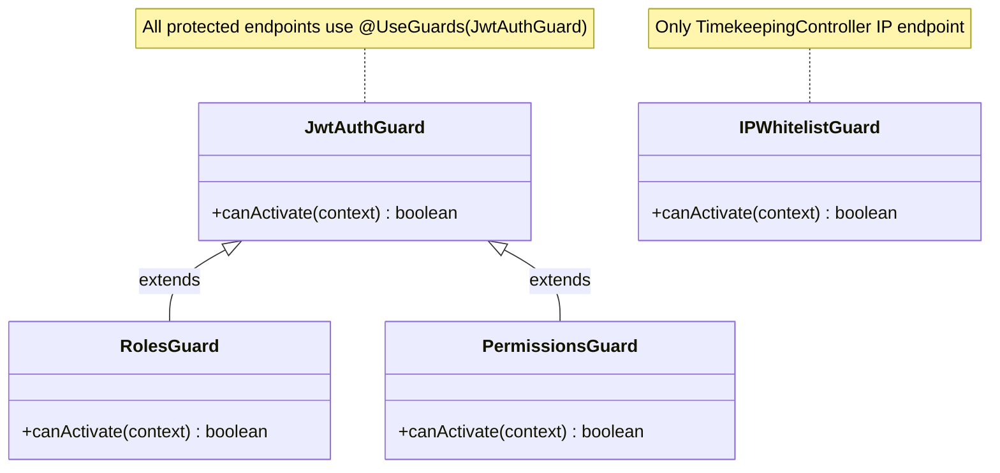

# UML Class Diagram — HRM System

> Service layer architecture, module dependencies, and class hierarchy.

---

## Module Dependency Graph

```mermaid
graph TD
    subgraph CoreModules["Core Modules"]
        Auth["Auth Module"]
        Employees["Employees Module"]
        Departments["Departments Module"]
        Positions["Positions Module"]
        Permissions["Permissions Module"]
        CompanyProfile["Company Profile Module"]
        CompanySettings["Company Settings Module"]
    end

    subgraph HROperations["HR Operations"]
        Contracts["Contracts Module"]
        Leave["Leave Module"]
        Timekeeping["Timekeeping Module"]
        Violations["Violations Module"]
        Resignations["Resignations Module"]
    end

    subgraph Finance["Finance"]
        Payroll["Payroll Module"]
        KPI["KPI Module"]
    end

    subgraph Communication["Communication"]
        Announcements["Announcements Module"]
        Messages["Messages Module"]
        Comments["Comments Module"]
        Notifications["Notifications Module"]
    end

    subgraph AnalyticsGroup["Analytics"]
        Dashboard["Dashboard Module"]
        Reports["Reports Module"]
        Analytics["Analytics Module"]
    end

    subgraph AdminGroup["Admin"]
        Admin["Admin Module"]
    end

    %% Core dependencies
    Auth --> Employees
    Auth --> Notifications

    Employees --> Departments
    Employees --> Positions
    Employees --> Permissions
    Employees --> CompanyProfile
    Employees --> CompanySettings

    %% HR Operations depend on Core
    Contracts --> Employees
    Leave --> Employees
    Leave --> Notifications
    Timekeeping --> Employees
    Timekeeping --> Notifications
    Timekeeping --> Violations
    Violations --> Employees
    Violations --> Notifications
    Resignations --> Employees
    Resignations --> Notifications

    %% Finance dependencies
    Payroll --> Employees
    Payroll --> KPI
    Payroll --> Notifications
    KPI --> Employees

    %% Communication dependencies
    Announcements --> Notifications
    Messages --> Notifications
    Comments --> Notifications

    %% Analytics dependencies
    Dashboard --> Employees
    Dashboard --> Payroll
    Dashboard --> Leave
    Dashboard --> Timekeeping
    Reports --> Employees
    Reports --> Payroll
    Reports --> Timekeeping
    Analytics --> Employees
    Analytics --> Payroll

    %% Admin dependencies
    Admin --> Employees
    Admin --> Permissions
    Admin --> CompanySettings

    %% Notifications hub
    Notifications -.-> Leave
    Notifications -.-> Payroll
    Notifications -.-> Timekeeping
    Notifications -.-> Violations
    Notifications -.-> Resignations
    Notifications -.-> Announcements
    Notifications -.-> Messages
    Notifications -.-> Comments
    Notifications -.-> Employees
```



---

## Service Layer Class Diagram

```mermaid
classDiagram
    direction TB

    class AuthService {
        -employeeRepo RepositoryEmployee
        -jwtService JwtService
        +validateUser(email, password) User
        +login(user) tokenData
        +register(dto) Employee
    }

    class EmployeesService {
        -employeeRepo RepositoryEmployee
        -deptRepo RepositoryDepartment
        -posRepo RepositoryPosition
        -dataSource DataSource
        -notificationsService NotificationsService
        +create(dto) Employee
        +findAll() EmployeeList
        +findAllPublic(user) PublicEmployeeList
        +findOne(id) Employee
        +update(id, dto) Employee
        +remove(id) void
        +search(keyword) SearchResult[]
    }

    class LeaveService {
        -leaveReqRepo RepositoryLeaveRequest
        -balanceRepo RepositoryLeaveBalance
        -leaveTypeRepo RepositoryLeaveType
        -employeeRepo RepositoryEmployee
        -notificationsService NotificationsService
        +getLeaveTypes() LeaveTypeList
        +getBalance(employeeId) LeaveBalanceList
        +getMyRequests(employeeId) LeaveRequestList
        +submitRequest(employeeId, leaveTypeId, startDate, endDate, reason) LeaveRequest
        +getPendingRequests() PendingLeaveData
        +approveLeaveRequest(requestId, status, managerId, adminNote) void
    }

    class TimeKeepingService {
        -tkRepo RepositoryTimeKeeping
        -empRepo RepositoryEmployee
        -violationRepo RepositoryViolation
        -notificationsService NotificationsService
        -dataSource DataSource
        -dynamicQrTokens TokenMap
        +generateDynamicQr() token
        +recordCheckInByDynamicQr(employeeId, token) result
        +recordCheckInByIP(employeeId, ip) result
        +getAllForAdmin(page, limit, startDate, endDate) paginated
    }

    class PayrollService {
        -STANDARD_MONTHLY_HOURS number
        -OVERTIME_RATE number
        -employeeRepo RepositoryEmployee
        -payslipRepo RepositoryPayslip
        -payrollPeriodRepo RepositoryPayrollPeriod
        -salaryConfigRepo RepositorySalaryConfig
        -leaveRequestRepo RepositoryLeaveRequest
        -adjustmentRepo RepositorySalaryAdjustment
        -settingsRepo RepositoryCompanySettings
        -kpiService KpiService
        -notificationsService NotificationsService
        -calculatePIT(taxableIncome) number
        -monthRange(month, year) dateRange
        -calculateAndSavePayslip(manager, employee, period, month, year, ctx) PayslipResult
        +runPayroll(month, year, createdBy) summary
        +generatePayslips(month, year, createdBy) summary
        +generateSinglePayslip(empId, month, year, createdBy) payslip
        +getPayslipsByPeriod(month, year) PayslipList
        +getEmployeePayslips(empId) PayslipList
        +getPayslipById(id) PayslipDetail
        +approvePayslip(id) Payslip
        +markPayslipPaid(id) Payslip
        +approveAllPayslips(month, year) count
        +getAllSalaryConfigs() configList
        +updateSalaryConfig(empId, data) config
        +createAdjustment(data) adjustment
        +getAllAdjustments(type) adjustmentList
        +updateAdjustment(id, data) adjustment
    }

    class KpiService {
        -kpiLibraryRepo RepositoryKpiLibrary
        -kpiPeriodRepo RepositoryKpiPeriod
        -kpiAssignmentRepo RepositoryKpiAssignment
        -employeeRepo RepositoryEmployee
        -notificationsService NotificationsService
        +getPeriodByMonthAndYear(month, year) KpiPeriod
        +calculateFinalKpiScore(empId, periodId) number
        +createLibrary(dto, creatorId) KpiLibrary
        +updateLibrary(id, dto) void
        +getLibrary() KpiLibrary[]
        +createPeriod(dto) KpiPeriod
        +getPeriods() KpiPeriod[]
        +assignKpis(dto) KpiAssignment[]
        +updateActual(id, actualValue) KpiAssignment
        +gradeAssignment(id, managerScore) KpiAssignment
        +getEmployeeAssignments(empId, periodId) KpiAssignment[]
        +deleteAssignment(id) void
    }

    class NotificationsService {
        -notificationRepo RepositoryNotification
        -employeeRepo RepositoryEmployee
        -notificationsGateway NotificationsGateway
        +createNotification(userId, title, message, type, link) Notification
        +getUserNotifications(userId) NotificationList
        +markAsRead(id, userId) void
        +deleteNotification(id, userId) void
        +sendAnnouncementToAll(title, message) count
    }

    class NotificationsGateway {
        -jwtService JwtService
        -userSockets UserSocketMap
        +server Server
        +handleConnection(client) void
        +handleDisconnect(client) void
        -extractTokenFromCookie(cookieHeader) string
        +sendNotificationToUser(userId, notification) void
    }

    class ViolationsService {
        -violationRepo RepositoryViolation
        -employeeRepo RepositoryEmployee
        -timeKeepingRepo RepositoryTimeKeeping
        -notificationsService NotificationsService
        +create(dto) Violation
        +findAll(employeeId) ViolationData
        +findOne(id) Violation
        +update(id, dto) Violation
        +remove(id) void
        +handleDailyAttendanceSync() void
    }

    class ResignationsService {
        -resignationRepo RepositoryResignationRequest
        -employeeRepo RepositoryEmployee
        -notificationsService NotificationsService
        +submit(employeeId, dto) ResignationRequest
        +findAll() ResignationRequestList
        +updateStatus(id, status, adminNote) void
    }

    class AnnouncementsService {
        -announcementRepo RepositoryAnnouncement
        -notificationsService NotificationsService
        +create(dto) Announcement
        +findAll(filters) AnnouncementList
        +update(id, dto) Announcement
        +delete(id) void
    }

    class ContractsService {
        -contractRepo RepositoryContract
        -employeeRepo RepositoryEmployee
        -salaryHistoryRepo RepositorySalaryHistory
        -salaryConfigRepo RepositorySalaryConfig
        +create(dto) Contract
        +findAll(filters) ContractList
        +findByEmployee(employeeId) Contract[]
        +findOne(id) Contract
        +update(id, dto) Contract
        +remove(id) void
    }

    class MessagesService {
        -messageRepo RepositoryMessage
        -notificationsService NotificationsService
        +send(senderId, receiverId, content) Message
        +getConversation(userId1, userId2) MessageList
        +markRead(id) void
    }

    class CommentsService {
        -commentRepo RepositoryComment
        -notificationsService NotificationsService
        +add(entityType, entityId, authorId, content) Comment
        +findByEntity(entityType, entityId) CommentList
    }

    class DepartmentsService {
        -departmentRepo RepositoryDepartment
        -employeeRepo RepositoryEmployee
        +create(dto) Department
        +findAll() DepartmentList
        +findOne(id) Department
        +update(id, dto) Department
        +remove(id) void
    }

    class PositionsService {
        -positionRepo RepositoryPosition
        -permissionRepo RepositoryPermission
        +create(dto) Position
        +findAll() PositionList
        +findOne(id) Position
        +update(id, dto) Position
        +remove(id) void
        +assignPermissions(positionId, permissionIds) void
    }

    class PermissionsService {
        -permissionRepo RepositoryPermission
        -positionPermissionRepo RepositoryPositionPermission
        +findAll() PermissionList
        +findByPosition(positionId) PermissionList
        +grant(positionId, permissionId) void
        +revoke(positionId, permissionId) void
    }

    class DashboardService {
        -leaveRepo RepositoryLeaveRequest
        -resignationRepo RepositoryResignationRequest
        -employeeRepo RepositoryEmployee
        -leaveBalanceRepo RepositoryLeaveBalance
        -leaveTypeRepo RepositoryLeaveType
        -announcementsService AnnouncementsService
        +getEmployeeData(user) EmployeeDashboardData
        +getAdminData() AdminDashboardData
        +getHolidayList() Holiday[]
    }

    class ReportsService {
        -employeeRepo RepositoryEmployee
        -timeKeepingRepo RepositoryTimeKeeping
        -payslipRepo RepositoryPayslip
        +generateEmployeeReport(filters) Report
        +generatePayrollReport(month, year) Report
        +generateAttendanceReport(filters) Report
    }

    class AnalyticsService {
        -employeeRepo RepositoryEmployee
        -payslipRepo RepositoryPayslip
        -timeKeepingRepo RepositoryTimeKeeping
        +getEmployeeAnalytics() AnalyticsData
        +getPayrollAnalytics() AnalyticsData
        +getAttendanceAnalytics() AnalyticsData
    }

    %% ── Dependency arrows ──
    AuthService --> EmployeesService : validates employee

    EmployeesService --> DepartmentsService : uses departments
    EmployeesService --> PositionsService : uses positions
    EmployeesService --> PermissionsService : checks permissions

    LeaveService --> NotificationsService : notify submit approve
    LeaveService --> EmployeesService : validates employee

    TimeKeepingService --> NotificationsService : notify warning
    TimeKeepingService --> ViolationsService : auto creates violations
    TimeKeepingService --> EmployeesService : validates employee

    PayrollService --> KpiService : gets KPI scores
    PayrollService --> NotificationsService : notify approve paid
    PayrollService --> EmployeesService : uses employees

    ViolationsService --> NotificationsService : notify create update
    ViolationsService --> EmployeesService : validates employee

    ResignationsService --> NotificationsService : notify status change
    ResignationsService --> EmployeesService : updates employee status

    AnnouncementsService --> NotificationsService : notify publish

    MessagesService --> NotificationsService : notify new message
    CommentsService --> NotificationsService : notify new comment

    NotificationsService --> NotificationsGateway : emits realtime events

    ContractsService --> EmployeesService : validates employee

    PositionsService --> PermissionsService : manages permissions

    DashboardService --> EmployeesService : reads employee stats
    DashboardService --> PayrollService : reads payroll stats
    DashboardService --> LeaveService : reads leave stats
    DashboardService --> TimeKeepingService : reads attendance stats

    ReportsService --> EmployeesService : reads employee data
    ReportsService --> PayrollService : reads payroll data
    ReportsService --> TimeKeepingService : reads attendance data

    AnalyticsService --> EmployeesService : analyzes employees
    AnalyticsService --> PayrollService : analyzes payroll
    AnalyticsService --> TimeKeepingService : analyzes attendance
```



---

## Entity Inheritance / Extension

```
BaseEntity (TypeORM)
  └── All 29 entities extend implicitly
  └── Common columns via decorators:
      - @PrimaryGeneratedColumn() → auto-increment PK
      - @CreateDateColumn() → auto timestamp on insert
      - @UpdateDateColumn() → auto timestamp on update
```

---

## Guard & Decorator Hierarchy



---

## Controller → Service Mapping

| Controller | Service | Module |
|-----------|---------|--------|
| AuthController | AuthService | AuthModule |
| EmployeesController | EmployeesService | EmployeesModule |
| LeaveController | LeaveService | LeaveModule |
| TimekeepingController | TimeKeepingService | TimekeepingModule |
| AttendanceController | TimeKeepingService | TimekeepingModule |
| PayrollController | PayrollService | PayrollModule |
| SalaryHistoryController | ContractsService | ContractsModule |
| KpiController | KpiService | KpiModule |
| ViolationsController | ViolationsService | ViolationsModule |
| ResignationsController | ResignationsService | ResignationsModule |
| NotificationsController | NotificationsService | NotificationsModule |
| AnnouncementsController | AnnouncementsService | AnnouncementsModule |
| MessagesController | MessagesService | MessagesModule |
| CommentsController | CommentsService | CommentsModule |
| ContractsController | ContractsService | ContractsModule |
| DepartmentsController | DepartmentsService | DepartmentsModule |
| PositionsController | PositionsService | PositionsModule |
| PermissionsController | PermissionsService | PermissionsModule |
| CompanyProfileController | CompanyProfileService | CompanyProfileModule |
| AdminController | AdminService | AdminModule |
| ReportsController | ReportsService | ReportsModule |
| AnalyticsController | AnalyticsService | AnalyticsModule |
