# Sơ đồ Use Case — Hệ thống HRM

> Actor, use case và phạm vi hệ thống cho nền tảng HRM.

---

## Actor (Tác nhân)

| Actor | Mô tả | Vai trò trong hệ thống |
|-------|-------|------------------------|
| **Nhân viên (Employee)** | Nhân viên thông thường | Chấm công, nộp đơn nghỉ phép, xem phiếu lương, nhận thông báo, nhắn tin, xem KPI cá nhân |
| **Quản lý (Manager)** | Trưởng phòng/trưởng nhóm | Duyệt nghỉ phép, chấm điểm KPI, xem chấm công nhóm, xem dữ liệu đội nhóm |
| **HR** | Nhân sự | Quản lý nhân viên, duyệt nghỉ phép/từ chức, chạy bảng lương, xử lý vi phạm, quản lý hợp đồng |
| **Admin** | Quản trị hệ thống | Toàn quyền: RBAC, cài đặt công ty, tất cả thao tác CRUD, xem audit log |
| **Tài chính/Kế toán (Finance)** | Kế toán viên | Xem báo cáo lương, phân tích chi phí lương theo phòng ban, chạy bảng lương, duyệt phiếu lương |
| **Hệ thống (System)** | Tiến trình tự động | Cron jobs (đồng bộ chấm công), WebSocket events, QR token expiry, tự động tạo vi phạm |

---

## Sơ đồ Use Case

```mermaid
graph TD
    subgraph Actors["Tác nhân"]
        EMP["👤 Nhân viên"]
        MGR["👤 Quản lý"]
        HR["👤 HR"]
        ADMIN["👤 Admin"]
        FIN["👤 Tài chính"]
        SYS["⚙️ Hệ thống"]
    end

    subgraph Attendance["Chấm công"]
        UC1[Check-in bằng QR]
        UC2[Check-in bằng IP]
        UC3[Check-out]
        UC4[Xem chấm công cá nhân]
        UC5[Quản lý toàn bộ chấm công]
        UC6[Phát QR động]
        UC42[Quản lý whitelist IP]
    end

    subgraph Leave["Nghỉ phép"]
        UC7[Xem loại phép & số dư]
        UC8[Nộp đơn nghỉ phép]
        UC9[Xem lịch sử nghỉ phép]
        UC10[Duyệt/Từ chối nghỉ phép]
        UC11[Xem toàn bộ đơn nghỉ phép]
        UC43[Quản lý loại nghỉ phép]
    end

    subgraph Payroll["Bảng lương"]
        UC12[Xem phiếu lương cá nhân]
        UC13[Tạo bảng lương hàng tháng]
        UC14[Duyệt phiếu lương]
        UC15[Đánh dấu đã thanh toán]
        UC16[Cấu hình lương]
        UC17[Quản lý điều chỉnh lương]
        UC44[Xem báo cáo tổng lương]
        UC45[Phân tích lương theo phòng ban]
    end

    subgraph EmployeeMgmt["Quản lý nhân viên"]
        UC18[Xem danh bạ nhân viên]
        UC19[Tạo/Sửa nhân viên]
        UC20[Offboard nhân viên]
        UC21[Quản lý phòng ban & chức vụ]
        UC22[Quản lý hợp đồng lao động]
        UC46[Cập nhật hồ sơ cá nhân]
        UC47[Tải lên ảnh đại diện]
        UC48[Quản lý thông tin ngân hàng]
    end

    subgraph KPI["Hiệu suất (KPI)"]
        UC23[Xem KPI cá nhân]
        UC24[Quản lý thư viện KPI & kỳ đánh giá]
        UC25[Gán KPI & chấm điểm]
        UC49[Tính điểm KPI tổng hợp]
    end

    subgraph Communication["Giao tiếp nội bộ"]
        UC26[Gửi/Nhận tin nhắn 1:1]
        UC27[Tạo thông báo toàn công ty]
        UC28[Thêm bình luận]
        UC29[Nhận thông báo real-time]
        UC30[Đánh dấu thông báo đã đọc]
        UC50[Xem feed thông báo công ty]
    end

    subgraph Discipline["Kỷ luật"]
        UC31[Xem vi phạm cá nhân]
        UC32[Tạo/Sửa vi phạm]
        UC33[Xóa vi phạm]
        UC34[Đồng bộ vi phạm chấm công tự động]
    end

    subgraph Resignation["Từ chức"]
        UC35[Nộp đơn từ chức]
        UC36[Duyệt/Từ chối đơn từ chức]
    end

    subgraph Dashboard["Bảng điều khiển"]
        UC51[Xem dashboard nhân viên]
        UC52[Xem dashboard quản trị]
        UC53[Xem lịch ngày lễ]
    end

    subgraph Reports["Báo cáo & Phân tích"]
        UC54[Tạo báo cáo nhân viên]
        UC55[Tạo báo cáo chấm công]
        UC56[Tạo báo cáo bảng lương]
        UC57[Xem thống kê tổ chức]
        UC58[Phân tích dữ liệu nhân sự]
    end

    subgraph Admin["Quản trị hệ thống"]
        UC37[Quản lý phân quyền RBAC]
        UC38[Cấu hình hồ sơ công ty]
        UC39[Quản lý cài đặt hệ thống]
        UC40[Xem nhật ký kiểm toán]
        UC41[Gửi thông báo đến toàn bộ]
        UC59[Quản lý ngày lễ/nghỉ lễ]
        UC60[Đăng ký tài khoản admin]
        UC61[Xem ma trận phân quyền]
    end

    %% Employee connections
    EMP --> UC1
    EMP --> UC2
    EMP --> UC3
    EMP --> UC4
    EMP --> UC7
    EMP --> UC8
    EMP --> UC9
    EMP --> UC12
    EMP --> UC18
    EMP --> UC23
    EMP --> UC26
    EMP --> UC28
    EMP --> UC29
    EMP --> UC30
    EMP --> UC31
    EMP --> UC35
    EMP --> UC46
    EMP --> UC47
    EMP --> UC51
    EMP --> UC50

    %% Manager connections
    MGR --> UC5
    MGR --> UC7
    MGR --> UC8
    MGR --> UC9
    MGR --> UC10
    MGR --> UC11
    MGR --> UC12
    MGR --> UC14
    MGR --> UC18
    MGR --> UC23
    MGR --> UC25
    MGR --> UC26
    MGR --> UC28
    MGR --> UC29
    MGR --> UC30
    MGR --> UC31
    MGR --> UC49
    MGR --> UC51
    MGR --> UC50

    %% HR connections
    HR --> UC5
    HR --> UC10
    HR --> UC11
    HR --> UC13
    HR --> UC14
    HR --> UC15
    HR --> UC16
    HR --> UC17
    HR --> UC18
    HR --> UC19
    HR --> UC20
    HR --> UC21
    HR --> UC22
    HR --> UC25
    HR --> UC27
    HR --> UC32
    HR --> UC33
    HR --> UC36
    HR --> UC29
    HR --> UC30
    HR --> UC42
    HR --> UC43
    HR --> UC48
    HR --> UC52
    HR --> UC53
    HR --> UC54
    HR --> UC55
    HR --> UC56
    HR --> UC57
    HR --> UC50

    %% Admin connections
    ADMIN --> UC5
    ADMIN --> UC10
    ADMIN --> UC11
    ADMIN --> UC13
    ADMIN --> UC14
    ADMIN --> UC15
    ADMIN --> UC16
    ADMIN --> UC17
    ADMIN --> UC18
    ADMIN --> UC19
    ADMIN --> UC20
    ADMIN --> UC21
    ADMIN --> UC22
    ADMIN --> UC27
    ADMIN --> UC32
    ADMIN --> UC33
    ADMIN --> UC36
    ADMIN --> UC37
    ADMIN --> UC38
    ADMIN --> UC39
    ADMIN --> UC40
    ADMIN --> UC41
    ADMIN --> UC29
    ADMIN --> UC30
    ADMIN --> UC42
    ADMIN --> UC43
    ADMIN --> UC52
    ADMIN --> UC53
    ADMIN --> UC54
    ADMIN --> UC55
    ADMIN --> UC56
    ADMIN --> UC57
    ADMIN --> UC58
    ADMIN --> UC59
    ADMIN --> UC60
    ADMIN --> UC61
    ADMIN --> UC50

    %% Finance connections
    FIN --> UC13
    FIN --> UC14
    FIN --> UC15
    FIN --> UC44
    FIN --> UC45
    FIN --> UC12
    FIN --> UC52
    FIN --> UC56
    FIN --> UC29
    FIN --> UC30

    %% System connections
    SYS --> UC6
    SYS --> UC34
    SYS --> UC29
```

---

## Mô tả Use Case

### Module Chấm công (Attendance)

| ID | Use Case | Tác nhân | Mô tả |
|----|----------|----------|-------|
| UC1 | Check-in bằng QR | Nhân viên | Quét mã QR động để check-in; token TTL 35s, debounce 60s |
| UC2 | Check-in bằng IP | Nhân viên | Check-in từ địa chỉ IP văn phòng được whitelist (văn phòng/từ xa) |
| UC3 | Check-out | Nhân viên | Quét QR hoặc dùng IP để clock out; tính giờ làm việc |
| UC4 | Xem chấm công cá nhân | Nhân viên | Xem lịch sử chấm công cá nhân |
| UC5 | Quản lý toàn bộ chấm công | Quản lý, HR, Admin | Xem/lọc tất cả bản ghi chấm công kèm thống kê |
| UC6 | Phát QR động | Hệ thống | Tạo UUID token với TTL 35s lưu trong memory; tự động cleanup mỗi 60s |
| UC42 | Quản lý whitelist IP | HR, Admin | Cấu hình dải IP văn phòng cho phép check-in từ xa |

### Module Nghỉ phép (Leave)

| ID | Use Case | Tác nhân | Mô tả |
|----|----------|----------|-------|
| UC7 | Xem loại phép & số dư | Nhân viên, Quản lý | Xem các loại nghỉ phép khả dụng và số ngày còn lại |
| UC8 | Nộp đơn nghỉ phép | Nhân viên, Quản lý | Gửi đơn nghỉ phép (loại, ngày, lý do); tự động thông báo HR |
| UC9 | Xem lịch sử nghỉ phép | Nhân viên, Quản lý | Xem lịch sử nghỉ phép cá nhân kèm trạng thái |
| UC10 | Duyệt/Từ chối nghỉ phép | Quản lý, HR, Admin | Xem xét đơn → Duyệt (trừ số dư) hoặc Từ chối (hoàn lại nếu đã duyệt trước đó) |
| UC11 | Xem toàn bộ đơn nghỉ phép | Quản lý, HR, Admin | Xem tất cả đơn trong tổ chức kèm thống kê (tổng/đang chờ/đã duyệt/từ chối) |
| UC43 | Quản lý loại nghỉ phép | HR, Admin | CRUD loại nghỉ phép, cấu hình số ngày mặc định, có lương/không lương |

### Module Bảng lương (Payroll)

| ID | Use Case | Tác nhân | Mô tả |
|----|----------|----------|-------|
| UC12 | Xem phiếu lương cá nhân | Nhân viên, Quản lý, Tài chính | Xem phiếu lương cá nhân theo kỳ |
| UC13 | Tạo bảng lương hàng tháng | HR, Admin, Tài chính | Chạy bảng lương tháng: lấy chấm công + nghỉ phép + KPI → tính toán → lưu phiếu lương |
| UC14 | Duyệt phiếu lương | Quản lý, HR, Admin, Tài chính | Xem xét và duyệt từng phiếu lương hoặc toàn bộ |
| UC15 | Đánh dấu đã thanh toán | HR, Admin, Tài chính | Đánh dấu phiếu lương đã được chi trả |
| UC16 | Cấu hình lương | HR, Admin | Thiết lập lương cơ bản, phụ cấp, % thưởng KPI, số người phụ thuộc |
| UC17 | Quản lý điều chỉnh lương | HR, Admin | Tạo/cập nhật điều chỉnh thưởng hoặc phạt cho tháng cụ thể |
| UC44 | Xem báo cáo tổng lương | Tài chính | Xem tổng lương, lương cơ bản, thưởng, khấu trừ theo tháng/năm |
| UC45 | Phân tích lương theo phòng ban | Tài chính | Xem biểu đồ phân bổ lương theo phòng ban, lương trung bình |

### Module Quản lý nhân viên (Employee Management)

| ID | Use Case | Tác nhân | Mô tả |
|----|----------|----------|-------|
| UC18 | Xem danh bạ nhân viên | Tất cả | Duyệt/tìm kiếm danh bạ nhân viên (lọc theo phòng ban) |
| UC19 | Tạo/Sửa nhân viên | HR, Admin | Đăng ký nhân viên mới hoặc cập nhật hồ sơ |
| UC20 | Offboard nhân viên | HR, Admin | Chấm dứt nhân viên với lý do offboarding, cập nhật trạng thái |
| UC21 | Quản lý phòng ban & chức vụ | HR, Admin | CRUD cơ cấu tổ chức, chuyển nhân viên giữa các phòng ban |
| UC22 | Quản lý hợp đồng lao động | HR, Admin | Tạo/cập nhật/xóa hợp đồng lao động với mức lương và thời hạn |
| UC46 | Cập nhật hồ sơ cá nhân | Nhân viên | Cập nhật thông tin liên hệ, địa chỉ cá nhân |
| UC47 | Tải lên ảnh đại diện | Nhân viên | Upload ảnh đại diện cá nhân lên server |
| UC48 | Quản lý thông tin ngân hàng | HR, Admin | Quản lý tài khoản ngân hàng của nhân viên để trả lương |

### Module Hiệu suất (KPI)

| ID | Use Case | Tác nhân | Mô tả |
|----|----------|----------|-------|
| UC23 | Xem KPI cá nhân | Nhân viên, Quản lý | Xem KPI được gán và điểm số theo kỳ đánh giá |
| UC24 | Quản lý thư viện KPI & kỳ đánh giá | Admin | CRUD cho định nghĩa KPI (tên, mô tả, công thức, đơn vị) và kỳ đánh giá |
| UC25 | Gán KPI & chấm điểm | Quản lý, HR | Gán KPI cho nhân viên, đặt mục tiêu, ghi nhận thực tế, tính điểm |
| UC49 | Tính điểm KPI tổng hợp | Quản lý | Tính điểm KPI cuối cùng = sum(thực_tế/mục_tiêu * 100 * trọng_số/100) |

### Module Giao tiếp nội bộ (Communication)

| ID | Use Case | Tác nhân | Mô tả |
|----|----------|----------|-------|
| UC26 | Gửi/Nhận tin nhắn 1:1 | Tất cả | Nhắn tin trực tiếp 1:1 giữa các nhân viên, đánh dấu đã đọc, xóa tin nhắn |
| UC27 | Tạo thông báo toàn công ty | HR, Admin | Đăng thông báo toàn công ty hoặc theo đối tượng mục tiêu |
| UC28 | Thêm bình luận | Tất cả | Bình luận trên mọi thực thể (nhân viên, hợp đồng, nghỉ phép...) |
| UC29 | Nhận thông báo real-time | Tất cả | Nhận thông báo đẩy WebSocket real-time cho mọi sự kiện liên quan |
| UC30 | Đánh dấu thông báo đã đọc | Tất cả | Đánh dấu từng thông báo hoặc tất cả là đã đọc; xóa thông báo |
| UC50 | Xem feed thông báo công ty | Tất cả | Xem bảng tin thông báo nội bộ đã lọc theo phòng ban/chức vụ |

### Module Kỷ luật (Discipline)

| ID | Use Case | Tác nhân | Mô tả |
|----|----------|----------|-------|
| UC31 | Xem vi phạm cá nhân | Nhân viên, Quản lý | Xem bản ghi vi phạm cá nhân kèm thống kê |
| UC32 | Tạo/Sửa vi phạm | HR, Admin | Tạo thủ công hoặc cập nhật bản ghi kỷ luật (loại, mức độ, tiền phạt) |
| UC33 | Xóa vi phạm | HR, Admin | Xóa bản ghi vi phạm |
| UC34 | Đồng bộ vi phạm chấm công | Hệ thống | Cron hàng ngày: quét ca làm không đủ → tự động tạo vi phạm → thông báo |

### Module Từ chức (Resignation)

| ID | Use Case | Tác nhân | Mô tả |
|----|----------|----------|-------|
| UC35 | Nộp đơn từ chức | Nhân viên | Gửi đơn từ chức với ngày làm việc cuối và lý do; kiểm tra trùng lặp |
| UC36 | Duyệt/Từ chối đơn từ chức | HR, Admin | Xem xét → Duyệt (chấm dứt nhân viên + hợp đồng) hoặc Từ chối; thông báo nhân viên |

### Module Bảng điều khiển (Dashboard)

| ID | Use Case | Tác nhân | Mô tả |
|----|----------|----------|-------|
| UC51 | Xem dashboard nhân viên | Nhân viên, Quản lý | Xem bảng điều khiển cá nhân với thông tin chấm công, nghỉ phép, KPI |
| UC52 | Xem dashboard quản trị | HR, Admin, Tài chính | Xem bảng điều khiển quản trị với thống kê toàn hệ thống |
| UC53 | Xem lịch ngày lễ | Tất cả | Xem danh sách ngày lễ/nghỉ lễ trong năm |

### Module Báo cáo & Phân tích (Reports & Analytics)

| ID | Use Case | Tác nhân | Mô tả |
|----|----------|----------|-------|
| UC54 | Tạo báo cáo nhân viên | HR, Admin | Tạo báo cáo về nhân viên với các bộ lọc |
| UC55 | Tạo báo cáo chấm công | HR, Admin | Tạo báo cáo chấm công theo thời gian, phòng ban |
| UC56 | Tạo báo cáo bảng lương | HR, Admin, Tài chính | Tạo báo cáo tổng hợp bảng lương theo tháng/năm |
| UC57 | Xem thống kê tổ chức | HR, Admin | Xem thống kê cơ cấu tổ chức, số lượng nhân viên theo phòng ban |
| UC58 | Phân tích dữ liệu nhân sự | Admin | Phân tích xu hướng nhân sự, chấm công, lương |

### Module Quản trị hệ thống (System Administration)

| ID | Use Case | Tác nhân | Mô tả |
|----|----------|----------|-------|
| UC37 | Quản lý phân quyền RBAC | Admin | CRUD quyền, gán quyền cho chức vụ (M:N), xem ma trận phân quyền |
| UC38 | Cấu hình hồ sơ công ty | Admin | Thiết lập tên công ty, mã số thuế, địa chỉ, tiền tệ, logo |
| UC39 | Quản lý cài đặt hệ thống | Admin | Cấu hình key-value (tỷ lệ bảo hiểm, IP whitelist, tên công ty...) |
| UC40 | Xem nhật ký kiểm toán | Admin | Theo dõi mọi hành động (ai làm gì với thực thể nào, khi nào) |
| UC41 | Gửi thông báo đến toàn bộ | Admin | Phát thông báo đến tất cả nhân viên cùng lúc |
| UC59 | Quản lý ngày lễ/nghỉ lễ | Admin | CRUD ngày lễ, tạo ngày lễ định kỳ, seed ngày lễ Việt Nam |
| UC60 | Đăng ký tài khoản admin | Admin | Đăng ký tài khoản quản trị đầu tiên (cần secret key) |
| UC61 | Xem ma trận phân quyền | Admin | Xem toàn bộ ma trận phân quyền Position × Permission |

---

## Kiểm soát truy cập dựa trên phân quyền (RBAC)

Hệ thống sử dụng mô hình **RBAC dựa trên chức vụ (Position)** với quan hệ **M:N** giữa Position và Permission. Các nhóm quyền chính:

| Nhóm quyền | Quyền ví dụ |
|------------|------------|
| `manage:employees` | Tạo, sửa, xóa, offboard nhân viên; quản lý hợp đồng |
| `manage:attendance` | Xem toàn bộ chấm công, quản lý bản ghi |
| `manage:leave` | Duyệt/từ chối đơn nghỉ phép, quản lý loại phép |
| `manage:payroll` | Tạo bảng lương, duyệt phiếu lương, cấu hình lương, xem báo cáo |
| `manage:system` | Cài đặt công ty, RBAC, audit log, thông báo, KPI |
| `manage:discipline` | Tạo/sửa/xóa vi phạm |
| `manage:resignation` | Xem xét và xử lý đơn từ chức |
| `manage:kpi` | Quản lý thư viện KPI, kỳ đánh giá, gán KPI |

Các route được bảo vệ bởi `JwtAuthGuard` (tất cả endpoint cần xác thực), `RolesGuard` (dựa trên chức vụ), và `PermissionsGuard` (dựa trên quyền). `IPWhitelistGuard` chỉ dùng cho endpoint check-in bằng IP.
