# Use Case Diagram — HRM System

> Actors, use cases, and system boundaries for the HRM platform.

---

## Actors

| Actor | Description | Role in System |
|-------|-------------|---------------|
| **Employee** | Regular staff member | Submit leave, check in/out, view payslips, receive notifications |
| **Manager** | Department/team lead | Approve leave, score KPIs, review attendance, view team data |
| **HR** | Human Resources personnel | Manage employees, approve leave/resignations, run payroll, handle violations |
| **Admin** | System administrator | Full access: RBAC, company settings, all CRUD operations |
| **System** | Automated processes | Cron jobs (attendance sync), WebSocket events, QR token expiry |

---

## Use Case Diagram

```mermaid
graph TD
    subgraph Actors
        EMP[👤 Employee]
        MGR[👤 Manager]
        HR[👤 HR]
        ADMIN[👤 Admin]
        SYS[⚙️ System]
    end

    subgraph Attendance["Attendance Module"]
        UC1[Check-in via QR]
        UC2[Check-in via IP]
        UC3[Check-out]
        UC4[View My Attendance]
        UC5[Manage All Attendance Records]
        UC6[Generate Dynamic QR]
    end

    subgraph Leave["Leave Module"]
        UC7[View Leave Types & Balance]
        UC8[Submit Leave Request]
        UC9[View My Leave Requests]
        UC10[Approve / Reject Leave]
        UC11[View All Leave Requests]
    end

    subgraph Payroll["Payroll Module"]
        UC12[View My Payslips]
        UC13[Generate Payroll / Payslips]
        UC14[Approve Payslips]
        UC15[Mark Payslips as Paid]
        UC16[Configure Salary]
        UC17[Manage Salary Adjustments]
    end

    subgraph EmployeeMgmt["Employee Management"]
        UC18[View Employee Directory]
        UC19[Create / Edit Employee]
        UC20[Offboard Employee]
        UC21[Manage Departments & Positions]
        UC22[Manage Contracts]
    end

    subgraph KPI["Performance (KPI)"]
        UC23[View My KPIs]
        UC24[Manage KPI Library & Periods]
        UC25[Assign KPIs & Score]
    end

    subgraph Communication["Communication"]
        UC26[Send / Receive Messages]
        UC27[Create Announcements]
        UC28[Add Comments]
        UC29[Receive Real-time Notifications]
        UC30[Mark Notifications as Read]
    end

    subgraph Discipline["Discipline"]
        UC31[View My Violations]
        UC32[Create / Update Violations]
        UC33[Delete Violations]
        UC34[Auto-sync Attendance Violations]
    end

    subgraph Resignation["Resignation"]
        UC35[Submit Resignation]
        UC36[Review & Approve / Reject]
    end

    subgraph Admin["System Administration"]
        UC37[Manage RBAC Permissions]
        UC38[Configure Company Profile]
        UC39[Manage Company Settings]
        UC40[View Audit Logs]
        UC41[Send Announcements to All]
    end

    %% Employee connections
    EMP --> UC1
    EMP --> UC2
    EMP --> UC3
    EMP --> UC4
    EMP --> UC7
    EMP --> UC8
    EMP --> UC9
    EMP --> UC12
    EMP --> UC18
    EMP --> UC23
    EMP --> UC26
    EMP --> UC28
    EMP --> UC29
    EMP --> UC30
    EMP --> UC31
    EMP --> UC35

    %% Manager connections
    MGR --> UC5
    MGR --> UC7
    MGR --> UC8
    MGR --> UC9
    MGR --> UC10
    MGR --> UC11
    MGR --> UC12
    MGR --> UC14
    MGR --> UC18
    MGR --> UC23
    MGR --> UC25
    MGR --> UC26
    MGR --> UC28
    MGR --> UC29
    MGR --> UC30
    MGR --> UC31

    %% HR connections
    HR --> UC5
    HR --> UC10
    HR --> UC11
    HR --> UC13
    HR --> UC14
    HR --> UC15
    HR --> UC16
    HR --> UC17
    HR --> UC18
    HR --> UC19
    HR --> UC20
    HR --> UC21
    HR --> UC22
    HR --> UC25
    HR --> UC27
    HR --> UC32
    HR --> UC33
    HR --> UC36
    HR --> UC29
    HR --> UC30

    %% Admin connections
    ADMIN --> UC5
    ADMIN --> UC10
    ADMIN --> UC11
    ADMIN --> UC13
    ADMIN --> UC14
    ADMIN --> UC15
    ADMIN --> UC16
    ADMIN --> UC17
    ADMIN --> UC18
    ADMIN --> UC19
    ADMIN --> UC20
    ADMIN --> UC21
    ADMIN --> UC22
    ADMIN --> UC27
    ADMIN --> UC32
    ADMIN --> UC33
    ADMIN --> UC36
    ADMIN --> UC37
    ADMIN --> UC38
    ADMIN --> UC39
    ADMIN --> UC40
    ADMIN --> UC41
    ADMIN --> UC29
    ADMIN --> UC30

    %% System connections
    SYS --> UC6
    SYS --> UC34
    SYS --> UC29
```

---

## Use Case Descriptions

### Attendance Module

| ID | Use Case | Actor(s) | Description |
|----|----------|----------|-------------|
| UC1 | Check-in via QR | Employee | Scan dynamic QR code to record check-in; 35s token TTL, 60s debounce |
| UC2 | Check-in via IP | Employee | Check in from office IP address (office/remote) |
| UC3 | Check-out | Employee | Scan QR or use IP to clock out; hours_worked calculated |
| UC4 | View My Attendance | Employee | View personal attendance history |
| UC5 | Manage All Attendance | Manager, HR, Admin | View/filter all attendance records with stats |
| UC6 | Generate Dynamic QR | System | Generate UUID token with 35s TTL stored in memory; auto-cleanup every 60s |

### Leave Module

| ID | Use Case | Actor(s) | Description |
|----|----------|----------|-------------|
| UC7 | View Leave Types & Balance | Employee, Manager | View available leave types and remaining balance |
| UC8 | Submit Leave Request | Employee, Manager | Submit leave (type, dates, reason); auto-notifies HR |
| UC9 | View My Leave Requests | Employee, Manager | View personal leave history with status |
| UC10 | Approve/Reject Leave | Manager, HR, Admin | Review request → Approve (deduct balance) or Reject (restore if was approved) |
| UC11 | View All Leave Requests | Manager, HR, Admin | View all requests across organization with stats (total/pending/approved/rejected) |

### Payroll Module

| ID | Use Case | Actor(s) | Description |
|----|----------|----------|-------------|
| UC12 | View My Payslips | Employee, Manager | View personal payslips by period |
| UC13 | Generate Payroll | HR, Admin | Run monthly payroll: fetch timekeeping + leave + KPI → calculate → save payslips |
| UC14 | Approve Payslips | Manager, HR, Admin | Review and approve individual or all payslips |
| UC15 | Mark Payslips Paid | HR, Admin | Mark payslips as paid after disbursement |
| UC16 | Configure Salary | HR, Admin | Set base_salary, allowances, KPI bonus %, dependents per employee |
| UC17 | Manage Adjustments | HR, Admin | Create/update bonus or penalty adjustments for a specific month |

### Employee Management

| ID | Use Case | Actor(s) | Description |
|----|----------|----------|-------------|
| UC18 | View Employee Directory | All | Browse/search employee directory (filtered by department) |
| UC19 | Create/Edit Employee | HR, Admin | Register new employee or update existing profile |
| UC20 | Offboard Employee | HR, Admin | Terminate employee with offboarding reason |
| UC21 | Manage Departments & Positions | HR, Admin | CRUD for organizational structure |
| UC22 | Manage Contracts | HR, Admin | Create/update employment contracts with salary rates and dates |

### Performance (KPI)

| ID | Use Case | Actor(s) | Description |
|----|----------|----------|-------------|
| UC23 | View My KPIs | Employee, Manager | View assigned KPIs and scores |
| UC24 | Manage KPI Library & Periods | Admin | CRUD for KPI definitions and assessment periods |
| UC25 | Assign KPIs & Score | Manager, HR | Assign KPIs to employees, set targets, record actuals, calculate scores |

### Communication

| ID | Use Case | Actor(s) | Description |
|----|----------|----------|-------------|
| UC26 | Send/Receive Messages | All | Direct 1:1 messaging between employees |
| UC27 | Create Announcements | HR, Admin | Publish company-wide or targeted announcements |
| UC28 | Add Comments | All | Comment on any entity (employee, contract, etc.) |
| UC29 | Receive Notifications | All | Real-time WebSocket push notifications on all relevant events |
| UC30 | Mark Notifications Read | All | Mark individual or all notifications as read; delete notifications |

### Discipline

| ID | Use Case | Actor(s) | Description |
|----|----------|----------|-------------|
| UC31 | View My Violations | Employee, Manager | View personal violation records with stats |
| UC32 | Create/Update Violations | HR, Admin | Manually create or update disciplinary records |
| UC33 | Delete Violations | HR, Admin | Remove violation records |
| UC34 | Auto-sync Violations | System | Daily cron: scan incomplete shifts → auto-create violations → notify |

### Resignation

| ID | Use Case | Actor(s) | Description |
|----|----------|----------|-------------|
| UC35 | Submit Resignation | Employee | Submit resignation with last working day and reason; duplicate check |
| UC36 | Review & Approve/Reject | HR, Admin | Review → Approve (terminate employee + contract) or Reject; notify employee |

### System Administration

| ID | Use Case | Actor(s) | Description |
|----|----------|----------|-------------|
| UC37 | Manage RBAC Permissions | Admin | CRUD for permissions, assign permissions to positions (M:N) |
| UC38 | Configure Company Profile | Admin | Set company name, tax ID, address, currency, logo |
| UC39 | Manage Company Settings | Admin | Key-value settings (insurance rate, etc.) |
| UC40 | View Audit Logs | Admin | Track all actions (who did what to which entity, when) |
| UC41 | Send Announcements to All | Admin | Broadcast notification to every employee at once |

---

## Permission-Based Access Control

The system uses a **position-based RBAC** model with **M:N** relationship between Position and Permission. Key permission categories:

| Permission Group | Example Permissions |
|-----------------|-------------------|
| `manage:employee` | Create, edit, delete, offboard employees |
| `manage:attendance` | View all attendance, manage records |
| `manage:leave` | Approve/reject leave requests |
| `manage:payroll` | Generate payroll, approve payslips, configure salary |
| `manage:system` | Company settings, RBAC, audit logs, announcements |
| `manage:discipline` | Create/update/delete violations |
| `manage:resignation` | Review and process resignations |
| `manage:kpi` | Manage KPI library, periods, assignments |

Routes are protected by `JwtAuthGuard` (all authenticated endpoints), `RolesGuard` (position-based), and `PermissionsGuard` (permission-based). The `IPWhitelistGuard` is used exclusively on the timekeeping IP check-in endpoint.
